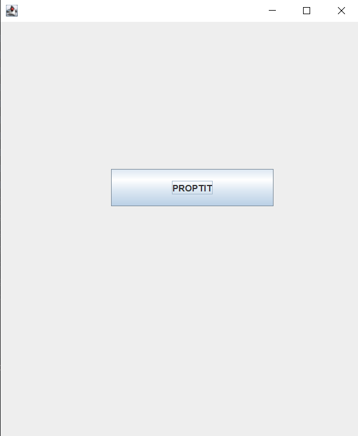
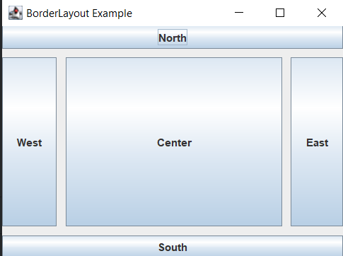
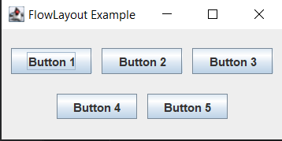
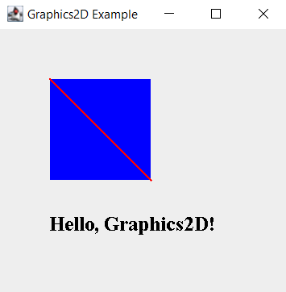
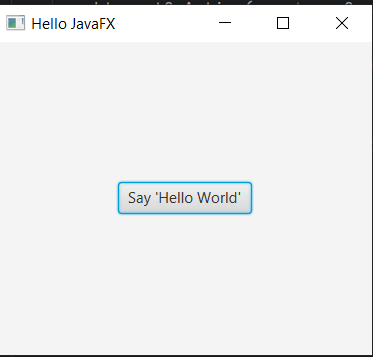
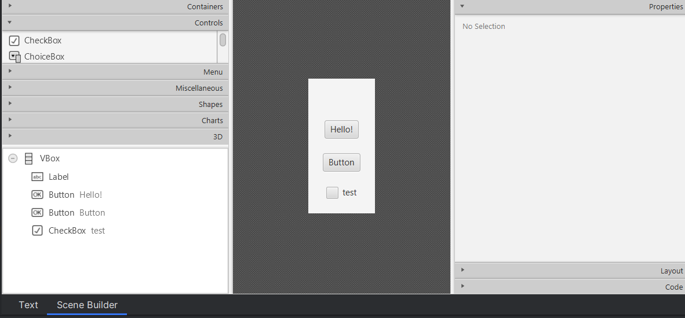

# [JAVA] - Buổi 10 (Final): Thư viện đồ họa Swing và JavaFX


## 1. Java Swing

### Thư viện đồ họa Swing cơ bản

  - Java Swing là một phần của Java Foundation Classes (JFC), cung cấp các thành phần giao diện đồ họa (GUI) để xây dựng ứng dụng desktop. Swing được xây dựng trên AWT (Abstract Window Toolkit) và cung cấp nhiều tính năng mạnh mẽ, linh hoạt hơn.

  - Swing có số lượng thành phần Giao diện người dùng gấp khoảng bốn lần so với AWT và là một phần của bản phân phối Java chuẩn. Theo yêu cầu của GUI ứng dụng ngày nay, AWT là một triển khai hạn chế, không hoàn toàn có khả năng cung cấp các thành phần cần thiết để phát triển GUI phức tạp cần thiết trong các ứng dụng thương mại hiện đại. Bộ thành phần AWT có khá nhiều lỗi và chiếm nhiều tài nguyên hệ thống khi so sánh với các tài nguyên Swing tương đương
- #### So sánh Java Swing và AWT


| Đặc điểm | Java AWT | Java Swing |
|---|---|---|
| **Phụ thuộc nền tảng** | Phụ thuộc vào nền tảng; sử dụng các thành phần giao diện gốc của hệ điều hành. | Độc lập với nền tảng; các thành phần được viết hoàn toàn bằng Java. |
| **Trọng lượng thành phần** | Thành phần nặng (heavyweight); mỗi thành phần tương ứng với một đối tượng gốc của hệ điều hành. | Thành phần nhẹ (lightweight); không phụ thuộc vào các đối tượng gốc. |
| **Số lượng thành phần** | Cung cấp ít thành phần hơn. | Cung cấp nhiều thành phần phong phú như JTable, JList, JScrollPane, JColorChooser, JTabbedPane, v.v. |
| **Hỗ trợ Pluggable Look and Feel** | Không hỗ trợ. | Hỗ trợ; cho phép thay đổi giao diện của ứng dụng mà không ảnh hưởng đến mã nguồn. |
| **Mô hình MVC (Model-View-Controller)** | Không tuân theo mô hình MVC. | Tuân theo mô hình MVC, giúp tách biệt dữ liệu, giao diện và điều khiển. |
| **Hiệu suất** | Nhanh hơn do sử dụng thành phần gốc. | Chậm hơn một chút do xử lý giao diện trong Java. |
| **Khả năng tùy biến** | Hạn chế trong việc tùy biến giao diện. | Dễ dàng tùy biến và mở rộng các thành phần giao diện. |

- #### Swing class hierrarchy
    

- #### Ví dụ

```java

import java.io.*;
import javax.swing.*;

// Main class
class Demo {

    // Main driver method
    public static void main(String[] args)
    {
        // Creating instance of JFrame
        JFrame frame = new JFrame();

        // Creating instance of JButton
        JButton button = new JButton("PROPTIT");

        // x axis, y axis, width, height
        button.setBounds(150, 200, 220, 50);

        // adding button in JFrame
        frame.add(button);

        // 400 width and 500 height
        frame.setSize(500, 600);

        // using no layout managers
        frame.setLayout(null);

        // making the frame visible
        frame.setVisible(true);
    }
}
```


### Một số thành phần cơ bản

- **`JFrame`**: Là cửa sổ chính của ứng dụng Swing, chứa các thành phần GUI khác.
---
| Constructor | Mô tả |
|------------|-------|
| `JFrame()` | Đây là constructor mặc định của `JFrame`. Nó tạo một frame mới không có tiêu đề. |
| `JFrame(String title)` | Constructor này tạo một frame mới với tiêu đề được chỉ định. |
| `JFrame(GraphicsConfiguration gc)` | Constructor này tạo một `JFrame` sử dụng cấu hình đồ họa được chỉ định. |
| `JFrame(String title, GraphicsConfiguration gc)` | Constructor này tạo một `JFrame` với tiêu đề được chỉ định và sử dụng cấu hình đồ họa được chỉ định. |
| `JFrame(Rectangle bounds)` | Constructor này tạo một `JFrame` với giới hạn (kích thước) được chỉ định. |
| `JFrame(String title, Rectangle bounds)` | Constructor này tạo một `JFrame` với tiêu đề và giới hạn được chỉ định. |


| Phương thức | Mô tả |
|---|---|
| `setTitle(String title)` | Đặt tiêu đề cho cửa sổ. |
| `getTitle()` | Lấy tiêu đề hiện tại của cửa sổ. |
| `setSize(int width, int height)` | Thiết lập kích thước cho cửa sổ với chiều rộng và chiều cao cụ thể. |
| `setSize(Dimension d)` | Thiết lập kích thước cho cửa sổ bằng đối tượng `Dimension`. |
| `setLocation(int x, int y)` | Đặt vị trí của cửa sổ trên màn hình với tọa độ (x, y). |
| `setBounds(int x, int y, int width, int height)` | Đặt vị trí và kích thước cho cửa sổ. |
| `setResizable(boolean resizable)` | Cho phép hoặc không cho phép người dùng thay đổi kích thước cửa sổ. |
| `setDefaultCloseOperation(int operation)` | Xác định hành vi khi người dùng đóng cửa sổ (ví dụ: `EXIT_ON_CLOSE`). |
| `setVisible(boolean b)` | Hiển thị hoặc ẩn cửa sổ. |
| `setLayout(LayoutManager manager)` | Thiết lập bộ quản lý bố cục cho cửa sổ. |
| `add(Component comp)` | Thêm một thành phần giao diện vào cửa sổ. |
| `remove(Component comp)` | Loại bỏ một thành phần giao diện khỏi cửa sổ. |
| `pack()` | Tự động điều chỉnh kích thước cửa sổ vừa với nội dung bên trong. |
| `setIconImage(Image image)` | Đặt biểu tượng cho cửa sổ. |
| `getContentPane()` | Lấy đối tượng `Container` chính của cửa sổ, nơi chứa các thành phần giao diện. |
| `setJMenuBar(JMenuBar menubar)` | Đặt thanh menu cho cửa sổ. |
| `addWindowListener(WindowListener listener)` | Thêm bộ lắng nghe sự kiện cửa sổ. |
| `setLocationRelativeTo(Component c)` | Đặt vị trí cửa sổ tương đối so với một thành phần khác (hoặc giữa màn hình nếu `null`). |
| `dispose()` | Giải phóng tài nguyên và đóng cửa sổ. |

---

- **`JButton`**: Nút bấm, cho phép người dùng thực hiện một hành động khi nhấn vào.
---
| Constructor | Mô tả |
|---|---|
| `JButton()` | Tạo một nút không có văn bản và biểu tượng. |
| `JButton(String text)` | Tạo một nút với văn bản được chỉ định. |
| `JButton(Icon icon)` | Tạo một nút với biểu tượng được chỉ định. |
| `JButton(String text, Icon icon)` | Tạo một nút với văn bản và biểu tượng được chỉ định. |
| `JButton(Action a)` | Tạo một nút với các thuộc tính được lấy từ đối tượng `Action` cung cấp. |

| Phương thức | Mô tả |
|---|---|
| `void setText(String text)` | Đặt văn bản cho nút. |
| `String getText()` | Lấy văn bản hiện tại của nút. |
| `void setIcon(Icon icon)` | Đặt biểu tượng cho nút. |
| `Icon getIcon()` | Lấy biểu tượng hiện tại của nút. |
| `void setEnabled(boolean enabled)` | Kích hoạt hoặc vô hiệu hóa nút. |
| `void addActionListener(ActionListener listener)` | Thêm bộ lắng nghe sự kiện hành động cho nút. |
| `void setMnemonic(char mnemonic)` | Đặt phím tắt cho nút. |
| `void doClick()` | Kích hoạt sự kiện nhấn nút một cách lập trình. |
| `void setToolTipText(String text)` | Đặt văn bản gợi ý khi di chuột qua nút. |
| `void setHorizontalAlignment(int alignment)` | Đặt căn chỉnh ngang cho văn bản và biểu tượng trên nút. |
---


- **`JLabel`**: Nhãn, dùng để hiển thị văn bản hoặc hình ảnh.

---
| Constructor | Mô tả |
|---|---|
| `JLabel()` | Tạo một nhãn trống, không có văn bản và hình ảnh. |
| `JLabel(String text)` | Tạo một nhãn với văn bản được chỉ định. |
| `JLabel(Icon image)` | Tạo một nhãn với hình ảnh được chỉ định. |
| `JLabel(String text, int horizontalAlignment)` | Tạo một nhãn với văn bản và căn chỉnh ngang được chỉ định. |
| `JLabel(Icon image, int horizontalAlignment)` | Tạo một nhãn với hình ảnh và căn chỉnh ngang được chỉ định. |
| `JLabel(String text, Icon image, int horizontalAlignment)` | Tạo một nhãn với văn bản, hình ảnh và căn chỉnh ngang được chỉ định. |

| Phương thức | Mô tả |
|---|---|
| `void setText(String text)` | Đặt văn bản cho nhãn. |
| `String getText()` | Lấy văn bản hiện tại của nhãn. |
| `void setIcon(Icon icon)` | Đặt biểu tượng (hình ảnh) cho nhãn. |
| `Icon getIcon()` | Lấy biểu tượng hiện tại của nhãn. |
| `void setHorizontalAlignment(int alignment)` | Đặt căn chỉnh ngang cho nội dung của nhãn (LEFT, CENTER, RIGHT). |
| `void setVerticalAlignment(int alignment)` | Đặt căn chỉnh dọc cho nội dung của nhãn (TOP, CENTER, BOTTOM). |
| `void setHorizontalTextPosition(int textPosition)` | Đặt vị trí ngang của văn bản so với biểu tượng (LEFT, CENTER, RIGHT). |
| `void setVerticalTextPosition(int textPosition)` | Đặt vị trí dọc của văn bản so với biểu tượng (TOP, CENTER, BOTTOM). |
| `void setIconTextGap(int gap)` | Đặt khoảng cách giữa văn bản và biểu tượng. |
| `void setToolTipText(String text)` | Đặt văn bản gợi ý (tooltip) khi di chuột qua nhãn. |

---

- **`JTextField`**: Ô nhập liệu một dòng, cho phép người dùng nhập và chỉnh sửa văn bản.
---
| Constructor | Mô tả |
|---|---|
| `JTextField()` | Tạo một ô nhập liệu trống. |
| `JTextField(String text)` | Tạo một ô nhập liệu với văn bản ban đầu được chỉ định. |
| `JTextField(int columns)` | Tạo một ô nhập liệu trống với số cột (độ rộng) được chỉ định. |
| `JTextField(String text, int columns)` | Tạo một ô nhập liệu với văn bản ban đầu và số cột được chỉ định. |
| `JTextField(Document doc, String text, int columns)` | Tạo một ô nhập liệu với tài liệu, văn bản ban đầu và số cột được chỉ định. |

| Phương thức | Mô tả |
|---|---|
| `void setText(String text)` | Đặt văn bản cho ô nhập liệu. |
| `String getText()` | Lấy văn bản hiện tại từ ô nhập liệu. |
| `void setColumns(int columns)` | Thiết lập số cột (độ rộng) cho ô nhập liệu. |
| `int getColumns()` | Lấy số cột hiện tại của ô nhập liệu. |
| `void setEditable(boolean editable)` | Cho phép hoặc không cho phép người dùng chỉnh sửa văn bản. |
| `boolean isEditable()` | Kiểm tra xem ô nhập liệu có thể chỉnh sửa hay không. |
| `void addActionListener(ActionListener listener)` | Thêm bộ lắng nghe sự kiện hành động cho ô nhập liệu. |
| `void setHorizontalAlignment(int alignment)` | Đặt căn chỉnh ngang cho văn bản trong ô nhập liệu (LEFT, CENTER, RIGHT). |
| `void setFont(Font f)` | Thiết lập phông chữ cho văn bản trong ô nhập liệu. |
| `void setForeground(Color fg)` | Đặt màu chữ cho văn bản trong ô nhập liệu. |
---
- **`JTable`**: Bảng, hiển thị dữ liệu dưới dạng lưới với các hàng và cột.
---
| Constructor | Mô tả |
|---|---|
| `JTable()` | Tạo một bảng rỗng không có dữ liệu. |
| `JTable(int rows, int cols)` | Tạo một bảng với số hàng và số cột được chỉ định. |
| `JTable(Object[][] data, Object[] columnNames)` | Tạo một bảng với dữ liệu và tên cột được cung cấp. |
| `JTable(TableModel model)` | Tạo một bảng dựa trên mô hình dữ liệu (`TableModel`) được cung cấp. |
| `JTable(TableModel model, TableColumnModel columnModel)` | Tạo một bảng với mô hình dữ liệu và mô hình cột được chỉ định. |
| `JTable(TableModel model, TableColumnModel columnModel, ListSelectionModel selectionModel)` | Tạo một bảng với mô hình dữ liệu, mô hình cột và mô hình lựa chọn được chỉ định. |

| Phương thức | Mô tả |
|---|---|
| `void setModel(TableModel dataModel)` | Đặt mô hình dữ liệu cho bảng. |
| `TableModel getModel()` | Lấy mô hình dữ liệu hiện tại của bảng. |
| `void setValueAt(Object aValue, int rowIndex, int columnIndex)` | Đặt giá trị cho ô tại vị trí hàng và cột xác định. |
| `Object getValueAt(int rowIndex, int columnIndex)` | Lấy giá trị của ô tại vị trí hàng và cột xác định. |
| `void addRowSelectionInterval(int index0, int index1)` | Chọn một khoảng hàng từ `index0` đến `index1`. |
| `int[] getSelectedRows()` | Lấy các chỉ số của các hàng được chọn. |
| `void setRowHeight(int rowHeight)` | Đặt chiều cao cho các hàng trong bảng. |
| `void setAutoCreateRowSorter(boolean autoCreateRowSorter)` | Kích hoạt hoặc vô hiệu hóa tính năng sắp xếp tự động cho bảng. |
| `void setShowGrid(boolean showGrid)` | Hiển thị hoặc ẩn lưới của bảng. |
| `void setCellSelectionEnabled(boolean cellSelectionEnabled)` | Cho phép hoặc không cho phép chọn từng ô trong bảng. |
---
- **`JList`**: Danh sách, hiển thị một danh sách các mục mà người dùng có thể chọn.
---
| Constructor | Mô tả |
|---|---|
| `JList()` | Tạo một danh sách trống với mô hình mặc định. |
| `JList(E[] listData)` | Tạo một danh sách hiển thị các phần tử từ mảng được cung cấp. |
| `JList(ListModel<E> dataModel)` | Tạo một danh sách dựa trên mô hình dữ liệu (`ListModel`) được cung cấp. |

| Phương thức | Mô tả |
|---|---|
| `void setListData(E[] listData)` | Đặt dữ liệu cho danh sách từ một mảng. |
| `void setListData(Vector<? extends E> listData)` | Đặt dữ liệu cho danh sách từ một vector. |
| `void setModel(ListModel<E> model)` | Đặt mô hình dữ liệu cho danh sách. |
| `ListModel<E> getModel()` | Lấy mô hình dữ liệu hiện tại của danh sách. |
| `void addListSelectionListener(ListSelectionListener listener)` | Thêm bộ lắng nghe sự kiện lựa chọn cho danh sách. |
| `int getSelectedIndex()` | Lấy chỉ số của mục được chọn đầu tiên. |
| `int[] getSelectedIndices()` | Lấy mảng các chỉ số của các mục được chọn. |
| `E getSelectedValue()` | Lấy giá trị của mục được chọn đầu tiên. |
| `List<E> getSelectedValuesList()` | Lấy danh sách các giá trị của các mục được chọn. |
| `void setSelectionMode(int selectionMode)` | Đặt chế độ lựa chọn cho danh sách (đơn, nhiều, khoảng). |
---
### Các bộ quản lý bố cục

- **`BorderLayout`**: là một trong những bộ quản lý bố cục (layout manager) cơ bản trong Java, thuộc gói java.awt. Nó sắp xếp các thành phần giao diện (components) vào năm vùng: Bắc (North), Nam (South), Đông (East), Tây (West) và Trung tâm (Center). Mỗi vùng có thể chứa tối đa một thành phần. 

    - Cách hoạt động của BorderLayout:
        - North: Nằm ở phía trên cùng, kéo dài theo chiều ngang.
        - South: Nằm ở phía dưới cùng, kéo dài theo chiều ngang.
        - East: Nằm ở phía bên phải, kéo dài theo chiều dọc.
        - West: Nằm ở phía bên trái, kéo dài theo chiều dọc.
        - Center: Nằm ở trung tâm, chiếm không gian còn lại.
    - Khi thêm một thành phần vào container sử dụng BorderLayout, cần chỉ định vùng mà thành phần đó sẽ nằm. Ví dụ:
        ```java
        container.add(component, BorderLayout.NORTH);
        ```
    - Constructor của BorderLayout:
        - BorderLayout(): Tạo một bố cục với khoảng cách mặc định giữa các thành phần.
        - BorderLayout(int hgap, int vgap): Tạo một bố cục với khoảng cách ngang (hgap) và dọc (vgap) được chỉ định.
    ```java
    import javax.swing.*;
    import java.awt.*;

    public class BorderLayoutExample {
        public static void main(String[] args) {
            JFrame frame = new JFrame("BorderLayout Example");
            frame.setDefaultCloseOperation(JFrame.EXIT_ON_CLOSE);
            frame.setSize(400, 300);
            frame.setLayout(new BorderLayout(10, 10)); // Khoảng cách ngang và dọc là 10 pixel

            JButton btnNorth = new JButton("North");
            JButton btnSouth = new JButton("South");
            JButton btnEast = new JButton("East");
            JButton btnWest = new JButton("West");
            JButton btnCenter = new JButton("Center");

            frame.add(btnNorth, BorderLayout.NORTH);
            frame.add(btnSouth, BorderLayout.SOUTH);
            frame.add(btnEast, BorderLayout.EAST);
            frame.add(btnWest, BorderLayout.WEST);
            frame.add(btnCenter, BorderLayout.CENTER);

            frame.setVisible(true);
        }
    }
    ```
    
- **`FlowLayout`**: Là một trong những bộ quản lý bố cục (layout manager) đơn giản trong Java, thuộc gói java.awt. Nó sắp xếp các thành phần (components) theo thứ tự từ trái sang phải, giống như cách các từ được sắp xếp trong một đoạn văn bản. Khi không còn đủ chỗ trên một dòng, các thành phần sẽ tự động chuyển xuống dòng tiếp theo. Đây là bố cục mặc định của các đối tượng JPanel. 

    - Các constructor của FlowLayout:

        - FlowLayout(): Tạo một bố cục với căn giữa và khoảng cách ngang, dọc mặc định là 5 pixel.
        - FlowLayout(int align): Tạo một bố cục với căn chỉnh được chỉ định (FlowLayout.LEFT, FlowLayout.CENTER, FlowLayout.RIGHT, FlowLayout.LEADING, hoặc FlowLayout.TRAILING) và khoảng cách mặc định là 5 pixel.
        - FlowLayout(int align, int hgap, int vgap): Tạo một bố cục với căn chỉnh và khoảng cách ngang (hgap), dọc (vgap) được chỉ định. 
    ```java
    import javax.swing.*;
    import java.awt.*;

    public class FlowLayoutExample {
        public static void main(String[] args) {
            JFrame frame = new JFrame("FlowLayout Example");
            frame.setDefaultCloseOperation(JFrame.EXIT_ON_CLOSE);
            frame.setSize(300, 150);
            frame.setLayout(new FlowLayout(FlowLayout.CENTER, 10, 20)); // Căn giữa, khoảng cách ngang 10px, dọc 20px

            frame.add(new JButton("Button 1"));
            frame.add(new JButton("Button 2"));
            frame.add(new JButton("Button 3"));
            frame.add(new JButton("Button 4"));
            frame.add(new JButton("Button 5"));

            frame.setVisible(true);
        }
    }
    ```
    
- **`GridLayout`**: là một bộ quản lý bố cục trong Java, thuộc gói java.awt, sắp xếp các thành phần trong một lưới hình chữ nhật với các ô có kích thước bằng nhau. Mỗi ô chứa một thành phần, và tất cả các ô đều có cùng kích thước. 

    - Các constructor của GridLayout:

        - GridLayout(): Tạo một bố cục lưới với một cột và số hàng tùy thuộc vào số lượng thành phần.
        - GridLayout(int rows, int cols): Tạo một bố cục lưới với số hàng và cột xác định. Một trong hai giá trị rows hoặc cols có thể là 0, cho phép số lượng hàng hoặc cột thay đổi dựa trên số lượng thành phần.
        - GridLayout(int rows, int cols, int hgap, int vgap): Tạo một bố cục lưới với số hàng, cột, khoảng cách ngang (hgap) và khoảng cách dọc (vgap) xác định. 
    ```java
    import javax.swing.*;
    import java.awt.*;

    public class GridLayoutExample {
        public static void main(String[] args) {
            JFrame frame = new JFrame("GridLayout Example");
            frame.setDefaultCloseOperation(JFrame.EXIT_ON_CLOSE);
            frame.setSize(300, 200);
            frame.setLayout(new GridLayout(2, 3, 5, 5)); // 2 hàng, 3 cột, khoảng cách 5px

            frame.add(new JButton("Button 1"));
            frame.add(new JButton("Button 2"));
            frame.add(new JButton("Button 3"));
            frame.add(new JButton("Button 4"));
            frame.add(new JButton("Button 5"));
            frame.add(new JButton("Button 6"));

            frame.setVisible(true);
        }
    }
    ```
    
### Vẽ đồ họa với `Graphics2D` và hiển thị hình ảnh với `Image`

- **`Graphics2D`**: Là một lớp trừu tượng trong Java, mở rộng từ lớp Graphics, cung cấp các phương thức mạnh mẽ để vẽ hình học 2D, quản lý màu sắc, biến đổi tọa độ và bố trí văn bản. Đây là lớp cơ bản cho việc render các hình dạng 2D, văn bản và hình ảnh trên nền tảng Java. 

    - Sử dụng Graphics2D trong Java: thường ghi đè phương thức paintComponent của một lớp kế thừa từ JPanel. Trong phương thức này, chuyển đổi đối tượng Graphics thành Graphics2D và sử dụng các phương thức của nó để vẽ.
    ```java
    import javax.swing.*;
    import java.awt.*;

    public class Graphics2DExample extends JPanel {
        @Override
        protected void paintComponent(Graphics g) {
            super.paintComponent(g);
            Graphics2D g2d = (Graphics2D) g;

            // Vẽ một hình chữ nhật
            g2d.setColor(Color.BLUE);
            g2d.fillRect(50, 50, 100, 100);

            // Vẽ một đường chéo
            g2d.setColor(Color.RED);
            g2d.setStroke(new BasicStroke(2));
            g2d.drawLine(50, 50, 150, 150);

            // Vẽ văn bản
            g2d.setColor(Color.BLACK);
            g2d.setFont(new Font("Serif", Font.BOLD, 20));
            g2d.drawString("Hello, Graphics2D!", 50, 200);
        }

        public static void main(String[] args) {
            JFrame frame = new JFrame("Graphics2D Example");
            frame.setDefaultCloseOperation(JFrame.EXIT_ON_CLOSE);
            frame.setSize(300, 300);
            frame.add(new Graphics2DExample());
            frame.setVisible(true);
        }
    }
    ```
    

- **`Image`**:  lớp trừu tượng Image thuộc gói java.awt là siêu lớp cho tất cả các lớp đại diện cho hình ảnh đồ họa. Do Image là một lớp trừu tượng, bạn không thể tạo trực tiếp một đối tượng từ nó. Thay vào đó, bạn có thể sử dụng các lớp con cụ thể như BufferedImage hoặc ImageIcon để làm việc với hình ảnh.
    - Cách tải và hiển thị hình ảnh trong Java:
    ```java
    import javax.swing.*;
    import java.awt.*;

    public class ImageExample {
        public static void main(String[] args) {
            JFrame frame = new JFrame("Image Example");
            frame.setDefaultCloseOperation(JFrame.EXIT_ON_CLOSE);
            frame.setSize(400, 300);

            // Tải hình ảnh từ tệp
            ImageIcon imageIcon = new ImageIcon("path/to/your/image.jpg");
            JLabel label = new JLabel(imageIcon);

            frame.add(label);
            frame.setVisible(true);
        }
    }
    ```
## 2. JavaFX

### Cấu trúc giao diện JavaFX

- JavaFX là một nền tảng để xây dựng ứng dụng giao diện đồ họa hiện đại, thay thế cho Swing. JavaFX cung cấp một hệ thống giao diện linh hoạt, hỗ trợ CSS và FXML để thiết kế giao diện.
- Trong JavaFX, cấu trúc giao diện người dùng được tổ chức theo mô hình phân cấp với ba thành phần chính: Stage, Scene và Node.
  - #### Stage (Sân khấu):
    - Stage đại diện cho cửa sổ chính của ứng dụng JavaFX, chứa toàn bộ nội dung giao diện.
    - Mỗi ứng dụng JavaFX có ít nhất một Stage chính, được nền tảng tự động tạo và truyền vào phương thức start() của lớp Application.
    - Lớp Stage nằm trong gói javafx.stage.

  - #### Scene (Cảnh):
    - Scene đại diện cho nội dung bên trong Stage, chứa các thành phần giao diện (nodes).
    - Một Stage có thể chứa một hoặc nhiều Scene, nhưng tại một thời điểm chỉ hiển thị một Scene.
    - Lớp Scene nằm trong gói javafx.scene.
  - #### Node (Nút):
    - Node là các thành phần giao diện cơ bản trong Scene, như các điều khiển (button, label), hình dạng (rectangle, circle), hoặc các bố cục (layout).
    - Các Node được tổ chức theo cấu trúc cây, gọi là "scene graph".
    - Lớp cơ bản cho tất cả các Node là javafx.scene.Node.
    
    ```java
    import javafx.application.Application;
    import javafx.scene.Scene;
    import javafx.scene.control.Button;
    import javafx.scene.layout.StackPane;
    import javafx.stage.Stage;

    public class SimpleJavaFXApp extends Application {
        @Override
        public void start(Stage primaryStage) {
            primaryStage.setTitle("Hello JavaFX");

            Button btn = new Button();
            btn.setText("Say 'Hello World'");
            btn.setOnAction(event -> System.out.println("Hello World!"));

            StackPane root = new StackPane();
            root.getChildren().add(btn);

            Scene scene = new Scene(root, 300, 250);
            primaryStage.setScene(scene);
            primaryStage.show();
        }

        public static void main(String[] args) {
            launch(args);
        }
    }
    ```
    - primaryStage là Stage chính của ứng dụng.
    - Scene chứa StackPane làm gốc, trong đó có một Button là Node con.
  
    
### Một số thành phần cơ bản

- **`Button`**: Nút bấm, cho phép người dùng thực hiện một hành động khi nhấn vào.
  
| Constructor | Mô tả | Ví dụ |
|-------------|-------|-------|
| `Button()` | Tạo một button trống, không có văn bản. | `Button btn = new Button();` |
| `Button(String text)` | Tạo button với văn bản hiển thị. | `Button btn = new Button("Click Me");` |
| `Button(String text, Node graphic)` | Tạo button với văn bản và một **graphic** (hình ảnh hoặc icon). | 


  - Thêm CSS cho Button:
  
    ```css
    .my-button {
        -fx-background-color: #4CAF50;
        -fx-text-fill: white;
        -fx-font-size: 16px;
        -fx-padding: 10px 20px;
        -fx-border-radius: 5px;
    }
    ```
    ```java
    btn.getStyleClass().add("my-button");

    Scene scene = new Scene(root, 300, 200);
    scene.getStylesheets().add(getClass().getResource("style.css").toExternalForm());
    ```
- **`Label`**:  là một control dùng để hiển thị văn bản tĩnh trên giao diện người dùng. Nó thường được sử dụng để mô tả các thành phần khác trong UI.
    - Tạo Label đơn giản:
    ```java
    import javafx.application.Application;
    import javafx.scene.Scene;
    import javafx.scene.control.Label;
    import javafx.scene.layout.StackPane;
    import javafx.stage.Stage;

    public class LabelExample extends Application {
        @Override
        public void start(Stage primaryStage) {
            Label label = new Label("Hello, JavaFX!");

            StackPane root = new StackPane();
            root.getChildren().add(label);

            Scene scene = new Scene(root, 300, 200);
            primaryStage.setTitle("JavaFX Label Example");
            primaryStage.setScene(scene);
            primaryStage.show();
        }

        public static void main(String[] args) {
            launch(args);
        }
    }
    ```
    - Tùy chỉnh Label:
        - Thay đổi Font và Màu chữ:
        ```java
        label.setStyle("-fx-font-size: 16px; -fx-text-fill: blue;");
        ```
        - Thêm Icon vào Label:
        ```java
        import javafx.scene.image.Image;
        import javafx.scene.image.ImageView;

        ImageView icon = new ImageView(new Image("file:icon.png"));
        Label labelWithIcon = new Label("With Icon", icon);
        ```

- **`TextField`**: Ô nhập liệu một dòng, cho phép người dùng nhập và chỉnh sửa văn bản.
    - Tạo TextField đơn giản:
    ```java
    import javafx.application.Application;
    import javafx.scene.Scene;
    import javafx.scene.control.TextField;
    import javafx.scene.layout.StackPane;
    import javafx.stage.Stage;

    public class TextFieldExample extends Application {
        @Override
        public void start(Stage primaryStage) {
            TextField textField = new TextField(); // Tạo một TextField

            StackPane root = new StackPane();
            root.getChildren().add(textField);

            Scene scene = new Scene(root, 300, 200);
            primaryStage.setTitle("JavaFX TextField Example");
            primaryStage.setScene(scene);
            primaryStage.show();
        }

        public static void main(String[] args) {
            launch(args);
        }
    }
    ```
    -  Tùy chỉnh giao diện:
        - Thay đổi kích thước chữ và màu nền:
        ```java
        textField.setStyle("-fx-font-size: 16px; -fx-background-color: lightgray;");
        ```
    -  Giới hạn độ dài ký tự nhập vào:
        ```java
        textField.textProperty().addListener((obs, oldValue, newValue) -> {
            if (newValue.length() > 10) {
                textField.setText(oldValue); // Giới hạn tối đa 10 ký tự
            }
        });
        ```
- **`CheckBox`**: Hộp kiểm, cho phép người dùng chọn hoặc bỏ chọn một tùy chọn. :contentReference[oaicite:3]{index=3}
    - Tạo CheckBox đơn giản:
    ```java
    import javafx.application.Application;
    import javafx.scene.Scene;
    import javafx.scene.control.CheckBox;
    import javafx.scene.layout.VBox;
    import javafx.stage.Stage;

    public class CheckBoxExample extends Application {
        @Override
        public void start(Stage primaryStage) {
            CheckBox checkBox = new CheckBox("Chọn tôi!"); // Tạo một CheckBox

            VBox root = new VBox(10);
            root.getChildren().add(checkBox);

            Scene scene = new Scene(root, 300, 200);
            primaryStage.setTitle("JavaFX CheckBox Example");
            primaryStage.setScene(scene);
            primaryStage.show();
        }

        public static void main(String[] args) {
            launch(args);
        }
    }
    ```
    - Lắng nghe sự kiện:
        ```java
                checkBox.setOnAction(event -> {
            if (checkBox.isSelected()) {
                System.out.println("Đã chọn!");
            } else {
                System.out.println("Bỏ chọn!");
            }
        });
        ```
### Các container

- **`HBox` (Horizontal Box)**: là một layout container trong JavaFX dùng để sắp xếp các thành phần theo chiều ngang.
    - Tạo HBox đơn giản:
    ```java
    import javafx.application.Application;
    import javafx.scene.Scene;
    import javafx.scene.control.Button;
    import javafx.scene.layout.HBox;
    import javafx.stage.Stage;

    public class HBoxExample extends Application {
        @Override
        public void start(Stage primaryStage) {
            Button btn1 = new Button("Button 1");
            Button btn2 = new Button("Button 2");
            Button btn3 = new Button("Button 3");

            HBox hbox = new HBox(10); // Khoảng cách giữa các phần tử là 10px
            hbox.getChildren().addAll(btn1, btn2, btn3);

            Scene scene = new Scene(hbox, 300, 100);
            primaryStage.setTitle("JavaFX HBox Example");
            primaryStage.setScene(scene);
            primaryStage.show();
        }

        public static void main(String[] args) {
            launch(args);
        }
    }
    ```
    -  Tùy chỉnh HBox bằng CSS:
    ```java
    hbox.setStyle("-fx-background-color: lightgray; -fx-border-radius: 5px;");
    ```
- **`VBox`**: Sắp xếp các thành phần con theo cột dọc.
    - Tạo VBox đơn giản:
    ```java
    import javafx.application.Application;
    import javafx.scene.Scene;
    import javafx.scene.control.Button;
    import javafx.scene.layout.VBox;
    import javafx.stage.Stage;

    public class VBoxExample extends Application {
        @Override
        public void start(Stage primaryStage) {
            Button btn1 = new Button("Button 1");
            Button btn2 = new Button("Button 2");
            Button btn3 = new Button("Button 3");

            VBox vbox = new VBox(10); // Khoảng cách giữa các phần tử là 10px
            vbox.getChildren().addAll(btn1, btn2, btn3);

            Scene scene = new Scene(vbox, 200, 150);
            primaryStage.setTitle("JavaFX VBox Example");
            primaryStage.setScene(scene);
            primaryStage.show();
        }

        public static void main(String[] args) {
            launch(args);
        }
    }

    ```
- **`BorderPane`**: Chia giao diện thành năm vùng: Top, Bottom, Left, Right và Center.

- **`GridPane`**: Sắp xếp các thành phần vào lưới với các hàng và cột.
    -  Tạo GridPane đơn giản:
    ```java
    import javafx.application.Application;
    import javafx.scene.Scene;
    import javafx.scene.control.Button;
    import javafx.scene.layout.GridPane;
    import javafx.stage.Stage;

    public class GridPaneExample extends Application {
        @Override
        public void start(Stage primaryStage) {
            GridPane gridPane = new GridPane();

            // Tạo các nút và đặt chúng vào GridPane (cột, hàng)
            Button btn1 = new Button("Button 1");
            Button btn2 = new Button("Button 2");
            Button btn3 = new Button("Button 3");
            Button btn4 = new Button("Button 4");

            gridPane.add(btn1, 0, 0); // Cột 0, Hàng 0
            gridPane.add(btn2, 1, 0); // Cột 1, Hàng 0
            gridPane.add(btn3, 0, 1); // Cột 0, Hàng 1
            gridPane.add(btn4, 1, 1); // Cột 1, Hàng 1

            Scene scene = new Scene(gridPane, 300, 200);
            primaryStage.setTitle("JavaFX GridPane Example");
            primaryStage.setScene(scene);
            primaryStage.show();
        }

        public static void main(String[] args) {
            launch(args);
        }
    }
    ```
    - Tùy chỉnh GridPane bằng CSS:
        -  Thay đổi màu nền và đường viền:
        ```java
        gridPane.setStyle("-fx-background-color: lightgray; -fx-border-color: black;");
        ```
        -   Đặt khoảng cách giữa các ô:
        ```java
        gridPane.setHgap(10);
        gridPane.setVgap(10);
        gridPane.setPadding(new Insets(10));
        ```

- **`AnchorPane`**: à một layout container trong JavaFX cho phép cố định vị trí của các phần tử con theo khoảng cách tương đối với viền của container (top, bottom, left, right).
    - Tạo AnchorPane đơn giản:
    ```java
    import javafx.application.Application;
    import javafx.scene.Scene;
    import javafx.scene.control.Button;
    import javafx.scene.layout.AnchorPane;
    import javafx.stage.Stage;

    public class AnchorPaneExample extends Application {
        @Override
        public void start(Stage primaryStage) {
            AnchorPane anchorPane = new AnchorPane();

            Button btn1 = new Button("Top Left");
            Button btn2 = new Button("Bottom Right");

            // Cố định btn1 ở góc trên trái (10px từ top, 10px từ left)
            AnchorPane.setTopAnchor(btn1, 10.0);
            AnchorPane.setLeftAnchor(btn1, 10.0);

            // Cố định btn2 ở góc dưới phải (10px từ bottom, 10px từ right)
            AnchorPane.setBottomAnchor(btn2, 10.0);
            AnchorPane.setRightAnchor(btn2, 10.0);

            anchorPane.getChildren().addAll(btn1, btn2);

            Scene scene = new Scene(anchorPane, 300, 200);
            primaryStage.setTitle("JavaFX AnchorPane Example");
            primaryStage.setScene(scene);
            primaryStage.show();
        }

        public static void main(String[] args) {
            launch(args);
        }
    }
    ```
    - Tùy chỉnh AnchorPane bằng CSS:
        -  Thay đổi màu nền:
        ```java
        anchorPane.setStyle("-fx-background-color: lightblue;");
        ```
        - Gán cả top, left, right, bottom cho một phần tử:
        ```java
        AnchorPane.setTopAnchor(btn, 10.0);
        AnchorPane.setBottomAnchor(btn, 10.0);
        AnchorPane.setLeftAnchor(btn, 10.0);
        AnchorPane.setRightAnchor(btn, 10.0);
        ```
### Sử dụng SceneBuilder và FXML để lập trình giao diện trong JavaFX

- **SceneBuilder**: Công cụ thiết kế giao diện đồ họa cho JavaFX, cho phép kéo thả các thành phần và tạo ra file FXML tương ứng.

- **FXML**: Ngôn ngữ đánh dấu XML được sử dụng để mô tả giao diện người dùng trong JavaFX. Việc tách biệt giao diện (FXML) và logic xử lý (Java) giúp mã nguồn rõ ràng và dễ bảo trì hơn.

- **Lợi ích của việc sử dụng FXML:**
    - Tách biệt giao diện và logic xử lý: Giao diện được định nghĩa trong file .fxml, còn logic xử lý nằm trong file Java (Controller.java).
    - Dễ dàng chỉnh sửa giao diện mà không cần thay đổi mã Java.
    - Tăng tốc phát triển ứng dụng nhờ khả năng kéo thả trên Scene Builder.


