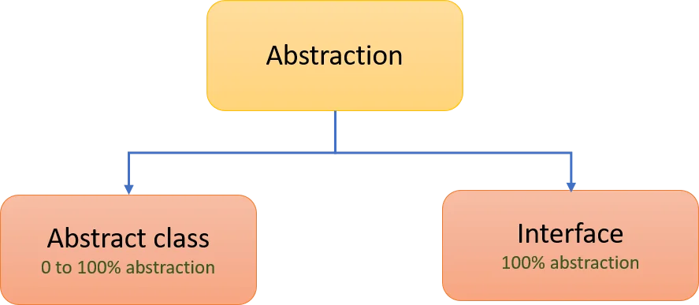

# [JAVA] - BUỔI 6: INTERFACE VÀ TRỪU TƯỢNG


## Interface là gì?
**Interface** là một cơ chế trong Java được sử dụng để định nghĩa một tập hợp các phương thức trừu tượng (abstract methods) mà các lớp khác phải thực hiện (implement). Một interface chỉ chứa các khai báo phương thức (method declarations) mà không có phần thực thi (implementation). Interface thiết lập một hợp đồng giữa class và thế giới bên ngoài, và hợp đồng này được thực thi trong quá trình biên dịch bởi trình biên dịch

### Đặc điểm của Interface:
- **Phương thức trong Interface:**
  - Mặc định là `public abstract`. Không cần (nhưng có thể) ghi rõ từ khóa này.
- **Biến trong Interface:**
  - Mặc định là `public static final`. Chúng là hằng số (constant).
- Được sử dụng để đạt được tính trừu tượng và kế thừa đa dạng trong Java.
- Thể hiện mối quan hệ IS-A.
### Cú pháp:
```java
interface InterfaceName {
    // Biến hằng số
    int CONSTANT = 10;

    // Phương thức trừu tượng
    void method1();
    void method2();
}
```

### Ví dụ:
```java
interface Animal {
    void eat();
    void sleep();
}

class Dog implements Animal {
    @Override
    public void eat() {
        System.out.println("Dog is eating.");
    }

    @Override
    public void sleep() {
        System.out.println("Dog is sleeping.");
    }
}

public class Main {
    public static void main(String[] args) {
        Animal dog = new Dog();
        dog.eat();
        dog.sleep();
    }
}
```

- **Interface `Animal`:** Chứa các phương thức trừu tượng `eat` và `sleep`.
- **Lớp `Dog`:** Implement interface `Animal` và cung cấp phần thực thi cho các phương thức.
- **Output:**
  ```
  Dog is eating.
  Dog is sleeping.
  ```

---

## Abstract Class là gì?
**Abstract Class** là một lớp trong Java được khai báo với từ khóa `abstract`. Một abstract class có thể chứa cả phương thức có thực thi (concrete methods) và phương thức trừu tượng (abstract methods).

### Đặc điểm của Abstract Class:
- Có thể có cả **phương thức trừu tượng** và **phương thức cụ thể**.
- Không thể tạo đối tượng trực tiếp từ abstract class.
- Một lớp có thể **extend** (kế thừa) từ một abstract class.

### Cú pháp:
```java
abstract class AbstractClassName {
    // Phương thức trừu tượng
    abstract void abstractMethod();

    // Phương thức cụ thể
    void concreteMethod() {
        System.out.println("This is a concrete method.");
    }
}
```

### Ví dụ:
```java
abstract class Shape {
    String color;

    // Constructor
    Shape(String color) {
        this.color = color;
    }

    // Phương thức trừu tượng
    abstract double calculateArea();

    // Phương thức cụ thể
    void displayColor() {
        System.out.println("Color: " + color);
    }
}

class Circle extends Shape {
    double radius;

    Circle(String color, double radius) {
        super(color);
        this.radius = radius;
    }

    @Override
    double calculateArea() {
        return Math.PI * radius * radius;
    }
}

public class Main {
    public static void main(String[] args) {
        Shape circle = new Circle("Red", 5);
        circle.displayColor();
        System.out.println("Area: " + circle.calculateArea());
    }
}
```

### Phân tích:
- **Abstract Class `Shape`:** Chứa phương thức trừu tượng `calculateArea` và phương thức cụ thể `displayColor`.
- **Lớp `Circle`:** Kế thừa từ `Shape` và cung cấp phần thực thi cho phương thức `calculateArea`.
- **Output:**
  ```
  Color: Red
  Area: 78.53981633974483
  ```

---

## So sánh Interface và Abstract Class

| Đặc điểm                          | Interface                          | Abstract Class                    |
|-----------------------------------|------------------------------------|------------------------------------|
| **Kế thừa**                       | Một lớp có thể implement nhiều interface. | Một lớp chỉ có thể extend một abstract class. |
| **Phương thức**                   | Chỉ chứa phương thức trừu tượng (Java 7). Từ Java 8 trở lên, có thể có phương thức mặc định (`default`) hoặc static. | Có thể chứa cả phương thức trừu tượng và phương thức cụ thể. |
| **Biến**                          | Chỉ chứa biến hằng số (`public static final`). | Có thể chứa biến không phải hằng số. |
| **Từ khóa**                       | Sử dụng từ khóa `interface`.       | Sử dụng từ khóa `abstract`.       |
| **Ứng dụng**                      | Sử dụng để định nghĩa hành vi chung mà các lớp phải thực thi. | Sử dụng khi cần chia sẻ một phần mã chung giữa các lớp con. |

---

## Khi nào sử dụng Interface và Abstract Class?
- **Interface:** Khi bạn muốn định nghĩa một bộ hành vi chung cho các lớp không liên quan (ví dụ: `Animal`, `Vehicle`).
- **Abstract Class:** Khi bạn cần chia sẻ mã chung và có các lớp liên quan chặt chẽ với nhau (ví dụ: `Shape`, `Circle`, `Rectangle`).

## Tính trừu tượng
Tính **trừu tượng** trong lập trình là một khái niệm quan trọng trong OOP (Object-Oriented Programming), cho phép chúng ta ẩn đi các chi tiết cụ thể và chỉ giữ lại những thông tin quan trọng, giúp đơn giản hóa quá trình phát triển phần mềm. Trong Java, tính trừu tượng có thể được thực hiện thông qua **Abstract Classes** và **Interfaces**.



## Lợi ích của Tính Trừu Tượng
Tính trừu tượng giúp:
- **Giảm độ phức tạp**: Chúng ta có thể làm việc với các đối tượng qua các phương thức trừu tượng mà không cần biết chi tiết cụ thể về cách chúng hoạt động.
- **Tăng tính mở rộng**: Giúp cho mã dễ bảo trì và mở rộng khi thêm các lớp mới mà không cần thay đổi mã đã có.
- **Hỗ trợ đa kế thừa**: Interface cho phép một lớp kế thừa từ nhiều interface, giúp tránh được hạn chế của việc kế thừa đơn trong Java.


# Enum trong Java

**Enum (Enumeration)** là một kiểu dữ liệu đặc biệt trong Java được sử dụng để định nghĩa một tập hợp các hằng số. Enum giúp cho mã nguồn trở nên dễ đọc, an toàn và tránh các lỗi liên quan đến việc sử dụng các giá trị cố định (hardcoded).

---

## 1. Đặc điểm của Enum
- **Enum là một lớp đặc biệt**: Mỗi giá trị trong enum là một đối tượng static final.
- **Không thể kế thừa từ lớp khác**: Enum mặc định kế thừa lớp `java.lang.Enum`.
- **Enum có thể chứa:**
  - Các thuộc tính.
  - Phương thức.
  - Constructor (chỉ có thể là `private`).

---

## 2. Cách sử dụng Enum cơ bản

### Ví dụ:
```java
enum Day {
    MONDAY, TUESDAY, WEDNESDAY, THURSDAY, FRIDAY, SATURDAY, SUNDAY
}

public class Main {
    public static void main(String[] args) {
        Day today = Day.WEDNESDAY;

        // In giá trị Enum
        System.out.println("Today is: " + today);

        // Sử dụng Enum trong câu lệnh switch
        switch (today) {
            case MONDAY:
                System.out.println("Start of the work week!");
                break;
            case FRIDAY:
                System.out.println("Weekend is near!");
                break;
            case SATURDAY:
            case SUNDAY:
                System.out.println("It's the weekend!");
                break;
            default:
                System.out.println("It's a regular weekday.");
        }
    }
}
```

### Kết quả:
```
Today is: WEDNESDAY
It's a regular weekday.
```

---

## 3. Enum với các phương thức và Constructor

### Ví dụ:
```java
enum Level {
    LOW(1), MEDIUM(2), HIGH(3);

    private final int levelCode;

    // Constructor (phải là private)
    Level(int levelCode) {
        this.levelCode = levelCode;
    }

    // Getter
    public int getLevelCode() {
        return levelCode;
    }
}

public class Main {
    public static void main(String[] args) {
        // Lấy giá trị Enum và gọi phương thức
        for (Level level : Level.values()) {
            System.out.println("Level: " + level + ", Code: " + level.getLevelCode());
        }
    }
}
```

### Kết quả:
```
Level: LOW, Code: 1
Level: MEDIUM, Code: 2
Level: HIGH, Code: 3
```

---

## 4. Một số phương thức phổ biến của Enum

| Phương thức            | Mô tả                                                                           |
|------------------------|---------------------------------------------------------------------------------|
| `values()`             | Trả về mảng các giá trị trong enum.                                            |
| `valueOf(String name)` | Trả về giá trị enum tương ứng với tên được chỉ định.                           |
| `ordinal()`            | Trả về vị trí (index) của giá trị enum (bắt đầu từ 0).                         |
| `name()`               | Trả về tên của giá trị enum dưới dạng chuỗi (String).                         |

### Ví dụ sử dụng:
```java
enum Color {
    RED, GREEN, BLUE;
}

public class Main {
    public static void main(String[] args) {
        // Lấy tất cả giá trị Enum
        for (Color color : Color.values()) {
            System.out.println(color + " at index " + color.ordinal());
        }

        // Lấy Enum từ tên
        Color selectedColor = Color.valueOf("RED");
        System.out.println("Selected color: " + selectedColor);
    }
}
```

### Kết quả:
```
RED at index 0
GREEN at index 1
BLUE at index 2
Selected color: RED
```

---

## 5. Lợi ích khi sử dụng Enum
- **Dễ hiểu và an toàn**: Tránh việc sử dụng các giá trị cố định (`int`, `String`) khó đọc và dễ gây nhầm lẫn.
- **Dễ dàng quản lý**: Các hằng số được gom nhóm thành một kiểu dữ liệu duy nhất.
- **Tăng khả năng tái sử dụng**: Có thể bổ sung logic và thuộc tính vào enum.

---

## Khi nào nên sử dụng Enum?
- Khi cần định nghĩa một tập hợp các hằng số có ý nghĩa logic liên quan đến nhau.
- Khi cần quản lý các trạng thái, cấp độ hoặc thuộc tính mà có thể dự đoán trước.

