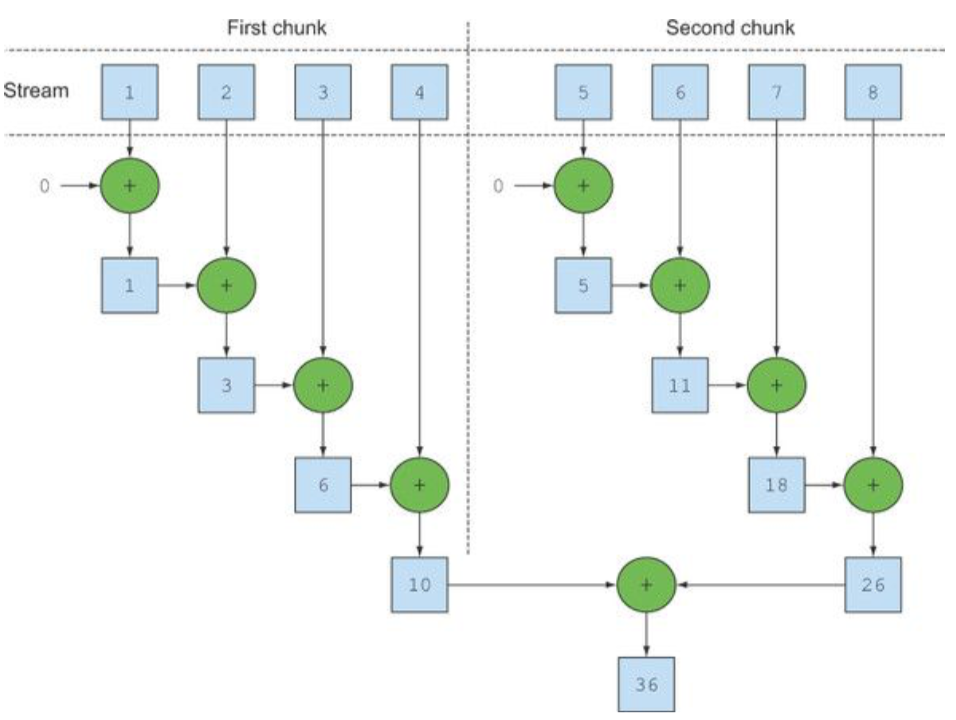

# JAVA - BUỔI 8: NHẬP XUẤT FILE, EXCEPTION, UNIT TEST
## Xử lý file trong Java
### Tổng quan về stream
- Stream (luồng) là một đối tượng mới của Java được giới thiệu từ phiên bản Java 8, giúp cho việc thao tác trên collection và array trở nên dễ dàng và tối ưu hơn.

- Một Stream đại diện cho một chuỗi các phần tử hỗ trợ các hoạt động tổng hợp tuần tự (sequential) và song song (parallel).

- Tất cả các class và interface của Stream API nằm trong gói java.util.stream. Bằng cách sử dụng các stream, chúng ta có thể thực hiện các phép toán tổng hợp khác nhau trên dữ liệu được trả về từ các collection, array, các hoạt động Input/Output.

#### Đặc điểm của Stream
- Không lưu trữ dữ liệu: Stream không phải là một cấu trúc dữ liệu; nó không lưu trữ các phần tử mà chỉ cung cấp các phép toán trên nguồn dữ liệu.

- Tính bất biến: Các thao tác trên Stream không thay đổi nguồn dữ liệu gốc; thay vào đó, chúng trả về một Stream mới với kết quả đã được biến đổi.

- Thực thi lười (lazy execution): Các thao tác trung gian (intermediate operations) trên Stream được thực hiện lười, nghĩa là chúng chỉ được thực thi khi có một thao tác kết thúc (terminal operation) được gọi.
- Collections thì có giới hạn, nhưng stream thì không. Các hoạt động xoay vòng như limit(n) hoặc findFirst() có thể tính toán trên luồng vô hạn trong thời gian hữu hạn.
- Các elements của stream chỉ được ghé qua một lần duy nhất. Giống như Iterator, một stream mới sẽ cần khởi tạo lại để truy cập lại elements đó.


#### Tạo Stream
Có 2 phương thức chuyển đổi là:
- stream() : trả về một luồng tuần tự với source là collection.
- parallelStream() : trả về một luồng song song với source là collection.

```java
List<String> myList = Arrays.asList("a", "b", "c", "d");
Stream<String> sequentialStream = myList.stream(); // Stream tuần tự
Stream<String> parallelStream = myList.parallelStream(); // Stream song song
```


Parallel stream là stream chia các phần tử của nó vào các chunks (solid piece of something), xử lí từng chunk với các thread khác nhau.




#### Các thao tác trên Stream
- Stream hỗ trợ hai loại thao tác chính:

1. Thao tác trung gian (Intermediate Operations): Trả về một Stream mới và được thực hiện lười. Ví dụ: filter(), map(), sorted().

2. Thao tác kết thúc (Terminal Operations): Kết thúc quá trình xử lý Stream và trả về kết quả. Ví dụ: collect(), count(), forEach().

```java
List<Integer> numbers = Arrays.asList(1, 2, 3, 4, 5, 6);
int sum = numbers.stream()
                 .filter(n -> n % 2 == 0) // Lọc các số chẵn
                 .mapToInt(Integer::intValue) // Chuyển đổi sang IntStream
                 .sum(); // Tính tổng
System.out.println("Tổng các số chẵn: " + sum);
```
```java
Tổng các số chẵn: 12.
```
### File trong java

Trong Java, việc thao tác với tệp (file) và thư mục (directory) được thực hiện thông qua các lớp trong gói `java.io` và `java.nio.file`. Dưới đây là hướng dẫn chi tiết về cách tạo, đọc, ghi, xóa tệp và thư mục trong Java.

#### Lớp `File` trong Java

Lớp `File` đại diện cho cả tệp và thư mục trong hệ thống tệp. Nó cung cấp các phương thức để tạo, xóa, kiểm tra thuộc tính và liệt kê nội dung của tệp hoặc thư mục.


| STT | Phương thức                            | Mô tả                                                                                         |
|-----|----------------------------------------|-----------------------------------------------------------------------------------------------|
| 1   | `boolean createNewFile()`              | Tạo một tệp mới; trả về `true` nếu tệp được tạo thành công, ngược lại trả về `false`.         |
| 2   | `boolean mkdir()`                      | Tạo một thư mục; trả về `true` nếu thư mục được tạo thành công, ngược lại trả về `false`.     |
| 3   | `boolean mkdirs()`                     | Tạo thư mục, bao gồm cả các thư mục cha nếu chúng chưa tồn tại; trả về `true` nếu thành công. |
| 4   | `boolean delete()`                     | Xóa tệp hoặc thư mục; trả về `true` nếu xóa thành công, ngược lại trả về `false`.             |
| 5   | `void deleteOnExit()`                  | Đánh dấu tệp hoặc thư mục để xóa khi chương trình kết thúc.                                   |
| 6   | `String[] list()`                      | Trả về mảng các tên tệp và thư mục con trong thư mục hiện tại.                                |
| 7   | `File[] listFiles()`                   | Trả về mảng các đối tượng `File` đại diện cho các tệp và thư mục con trong thư mục hiện tại.  |
| 8   | `boolean renameTo(File dest)`          | Đổi tên tệp hoặc thư mục; trả về `true` nếu thành công, ngược lại trả về `false`.             |
| 9   | `boolean exists()`                     | Kiểm tra xem tệp hoặc thư mục có tồn tại hay không.                                           |
| 10  | `boolean isFile()`                     | Kiểm tra xem đối tượng có phải là tệp hay không.                                              |
| 11  | `boolean isDirectory()`                | Kiểm tra xem đối tượng có phải là thư mục hay không.                                          |
| 12  | `long length()`                        | Trả về kích thước của tệp tính bằng byte.                                                     |
| 13  | `String getName()`                     | Trả về tên của tệp hoặc thư mục.                                                              |
| 14  | `String getPath()`                     | Trả về đường dẫn của tệp hoặc thư mục.                                                        |
| 15  | `String getAbsolutePath()`             | Trả về đường dẫn tuyệt đối của tệp hoặc thư mục.                                              |
| 16  | `File getParentFile()`                 | Trả về đối tượng `File` đại diện cho thư mục cha; có thể trả về `null` nếu không có thư mục cha. |
| 17  | `long lastModified()`                  | Trả về thời điểm tệp hoặc thư mục được sửa đổi lần cuối, tính bằng mili-giây từ epoch.        |
| 18  | `boolean canRead()`                    | Kiểm tra xem tệp có thể đọc được hay không.                                                  |
| 19  | `boolean canWrite()`                   | Kiểm tra xem tệp có thể ghi được hay không.                                                  |
| 20  | `boolean canExecute()`                 | Kiểm tra xem tệp có thể thực thi được hay không.                                             |

Ví dụ đọc từ tệp
```java
import java.io.BufferedReader;
import java.io.FileReader;
import java.io.IOException;

public class ReadFileExample {
    public static void main(String[] args) {
        try (BufferedReader reader = new BufferedReader(new FileReader("example.txt"))) {
            String line;
            while ((line = reader.readLine()) != null) {
                System.out.println(line);
            }
        } catch (IOException e) {
            System.out.println("Đã xảy ra lỗi khi đọc tệp.");
            e.printStackTrace();
        }
    }
}
```

**Lưu ý:** Một số phương thức có thể yêu cầu quyền truy cập đặc biệt hoặc có thể bị hạn chế tùy thuộc vào hệ điều hành và môi trường thực thi. Để biết thêm chi tiết về từng phương thức, bạn có thể tham khảo tài liệu chính thức của Java tại: [https://docs.oracle.com/javase/8/docs/api/java/io/File.html](https://docs.oracle.com/javase/8/docs/api/java/io/File.html)

### Character Stream và Byte Stream trong Java

Trong Java, hệ thống nhập/xuất (I/O) được chia thành hai loại chính: **Byte Stream** và **Character Stream**. Việc phân chia này giúp lập trình viên lựa chọn phương thức phù hợp khi xử lý dữ liệu, đặc biệt là khi làm việc với văn bản hoặc dữ liệu nhị phân.

#### Byte Stream

**Byte Stream** được sử dụng để xử lý dữ liệu ở mức byte, thích hợp cho việc đọc và ghi các dữ liệu nhị phân như hình ảnh, âm thanh, video, hoặc các tệp không chứa văn bản. Các lớp trong Java hỗ trợ Byte Stream bao gồm:

- **InputStream**: Lớp cha cho tất cả các lớp đọc dữ liệu ở mức byte.
- **OutputStream**: Lớp cha cho tất cả các lớp ghi dữ liệu ở mức byte.

Một số lớp con phổ biến:

- **FileInputStream**: Đọc dữ liệu từ tệp dưới dạng byte.
- **FileOutputStream**: Ghi dữ liệu vào tệp dưới dạng byte.

**Ví dụ về sử dụng Byte Stream:**

```java
import java.io.FileInputStream;
import java.io.FileOutputStream;
import java.io.IOException;

public class ByteStreamExample {
    public static void main(String[] args) {
        try (FileInputStream fis = new FileInputStream("input.dat");
             FileOutputStream fos = new FileOutputStream("output.dat")) {
            int byteData;
            while ((byteData = fis.read()) != -1) {
                fos.write(byteData);
            }
            System.out.println("Đã sao chép tệp thành công bằng Byte Stream.");
        } catch (IOException e) {
            System.out.println("Đã xảy ra lỗi: " + e.getMessage());
        }
    }
}
```
#### Character Stream
**Character Stream** được thiết kế để xử lý dữ liệu văn bản, làm việc với các ký tự Unicode. Điều này giúp việc đọc và ghi văn bản trở nên dễ dàng hơn, đặc biệt khi làm việc với các ngôn ngữ có bộ ký tự phức tạp. Các lớp trong Java hỗ trợ Character Stream bao gồm:

- Reader: Lớp cha cho tất cả các lớp đọc dữ liệu ở mức ký tự.
- Writer: Lớp cha cho tất cả các lớp ghi dữ liệu ở mức ký tự.
  
Một số lớp con phổ biến:
- FileReader: Đọc dữ liệu từ tệp dưới dạng ký tự.
- FileWriter: Ghi dữ liệu vào tệp dưới dạng ký tự.
```java
import java.io.FileReader;
import java.io.FileWriter;
import java.io.IOException;

public class CharacterStreamExample {
    public static void main(String[] args) {
        try (FileReader fr = new FileReader("input.txt");
             FileWriter fw = new FileWriter("output.txt")) {
            int charData;
            while ((charData = fr.read()) != -1) {
                fw.write(charData);
            }
            System.out.println("Đã sao chép tệp thành công bằng Character Stream.");
        } catch (IOException e) {
            System.out.println("Đã xảy ra lỗi: " + e.getMessage());
        }
    }
}
```
| Tiêu chí                     | Byte Stream                                                                                         | Character Stream                                                                                         |
|------------------------------|------------------------------------------------------------------------------------------------------|----------------------------------------------------------------------------------------------------------|
| **Đơn vị xử lý**             | Byte (8-bit)                                                                                         | Character (thường là 16-bit cho Unicode)                                                                 |
| **Lớp cơ sở**                | `InputStream` và `OutputStream`                                                                      | `Reader` và `Writer`                                                                                     |
| **Sử dụng cho**              | Dữ liệu nhị phân (hình ảnh, âm thanh, video)                                                         | Dữ liệu văn bản (text)                                                                                   |
| **Xử lý mã hóa ký tự**       | Không, dữ liệu được xử lý ở mức byte                                                                 | Có, tự động xử lý mã hóa và giải mã ký tự                                                                 |
| **Hiệu suất**                | Thường nhanh hơn khi làm việc với dữ liệu nhị phân                                                   | Thích hợp hơn cho văn bản, đặc biệt khi cần xử lý mã hóa ký tự phức tạp                                   |
| **Ví dụ về lớp**             | `FileInputStream`, `FileOutputStream`                                                                | `FileReader`, `FileWriter`                                                                               |
| **Phạm vi ứng dụng**         | Thích hợp cho các tệp nhị phân như hình ảnh, âm thanh, video                                         | Thích hợp cho các tệp văn bản chứa ký tự Unicode                                                          |
| **Xử lý dữ liệu**            | Đọc và ghi dữ liệu ở mức byte, không quan tâm đến mã hóa ký tự                                        | Đọc và ghi dữ liệu ở mức ký tự, tự động xử lý mã hóa và giải mã ký tự                                      |
| **Độ phức tạp**              | Đơn giản hơn khi làm việc với dữ liệu nhị phân                                                       | Phức tạp hơn khi làm việc với dữ liệu văn bản do cần xử lý mã hóa ký tự                                    |
| **Khả năng mở rộng**         | Dễ dàng mở rộng cho các loại dữ liệu nhị phân khác nhau                                              | Cần chú ý đến mã hóa ký tự khi mở rộng cho các loại văn bản khác nhau                                     |

### ObjectInputStream và ObjectOutputStream trong Java

Trong Java, hai lớp `ObjectInputStream` và `ObjectOutputStream` được sử dụng để tuần tự hóa (serialization) và giải tuần tự hóa (deserialization) các đối tượng. Điều này cho phép lưu trữ trạng thái của một đối tượng vào tệp hoặc truyền đối tượng qua mạng.

#### ObjectOutputStream


- `ObjectOutputStream` được sử dụng để ghi các đối tượng Java và các kiểu dữ liệu nguyên thủy vào một `OutputStream`. Các đối tượng được ghi sẽ được tuần tự hóa thành một chuỗi byte. 
**Cách sử dụng:**

1. **Khởi tạo:**
   ```java
   FileOutputStream fos = new FileOutputStream("objectdata.bin");
   ObjectOutputStream oos = new ObjectOutputStream(fos);
   ```
2. **Ghi đối tượng**
   ```java
   oos.close();
   fos.close();
   ```
3. **Đóng luồng**
   ```java
   oos.close();
   fos.close();
   ```
- Chỉ các đối tượng của các lớp triển khai giao diện Serializable mới có thể được tuần tự hóa và ghi bằng ObjectOutputStream.

#### ObjectInputStream
- `ObjectInputStream` được sử dụng để đọc các đối tượng và dữ liệu nguyên thủy đã được ghi bằng `ObjectOutputStream`. Nó giải tuần tự hóa các chuỗi byte thành các đối tượng Java
  
1. **Khởi tạo**

    ```java
    FileInputStream fis = new FileInputStream("objectdata.bin");
    ObjectInputStream ois = new ObjectInputStream(fis);
    ```
2. **Đọc đối tượng**

    ```java
    MyClass object = (MyClass) ois.readObject();
    ```
3. **Đóng luồng**

    ```java
    ois.close();
    fis.close();
    ```
- Khi đọc đối tượng, cần ép kiểu về lớp tương ứng và xử lý các ngoại lệ như ClassNotFoundException và IOException.
## BufferedReader và BufferedWriter trong Java

Trong Java, hai lớp `BufferedReader` và `BufferedWriter` được sử dụng để cải thiện hiệu suất khi đọc và ghi dữ liệu văn bản bằng cách sử dụng bộ đệm. Việc sử dụng bộ đệm giúp giảm số lần truy cập trực tiếp vào thiết bị I/O, từ đó tăng hiệu suất cho các hoạt động nhập/xuất.

### BufferedReader

`BufferedReader` đọc văn bản từ một luồng đầu vào ký tự, đệm các ký tự để cung cấp khả năng đọc hiệu quả các ký tự, mảng và chuỗi. 

**Cách khởi tạo:**

- **Sử dụng kích thước bộ đệm mặc định**

  ```java
  BufferedReader bufferedReader = new BufferedReader(new FileReader("input.txt"));
  ```
- **Sử dụng kích thước bộ đệm tùy chỉnh**
  ```java
  int bufferSize = 8192;
  BufferedReader bufferedReader = new BufferedReader(new FileReader("input.txt"), bufferSize);
  ```
Các phương thức chính:

- read(): Đọc một ký tự đơn lẻ.
- read(char[] cbuf, int off, int len): Đọc một phần của mảng ký tự.
- readLine(): Đọc một dòng văn bản.
- ready(): Kiểm tra xem luồng có sẵn để đọc hay không.
- close(): Đóng luồng và giải phóng tài nguyên liên quan.
### BufferedWriter
`BufferedWriter` ghi văn bản vào một luồng đầu ra ký tự, đệm các ký tự để cung cấp khả năng ghi hiệu quả các ký tự, mảng và chuỗi. 

Các phương thức chính:

- write(int c): Ghi một ký tự đơn lẻ.
- write(char[] cbuf, int off, int len): Ghi một phần của mảng ký tự.
- write(String s, int off, int len): Ghi một phần của chuỗi.
- newLine(): Ghi ký tự xuống dòng mới.
- flush(): Đẩy dữ liệu từ bộ đệm xuống luồng đầu ra.
- close(): Đóng luồng và giải phóng tài nguyên liên quan.

### Đường dẫn trong Hệ thống Tập tin

Trong hệ thống tập tin, **đường dẫn** (path) là chuỗi ký tự xác định vị trí của một tệp hoặc thư mục trong cấu trúc thư mục. Có hai loại đường dẫn chính:

1. **Đường dẫn tuyệt đối** (absolute path)
2. **Đường dẫn tương đối** (relative path)

#### Đường dẫn tuyệt đối

**Định nghĩa:**

- Đường dẫn tuyệt đối chứa đầy đủ các thành phần từ thư mục gốc đến tệp hoặc thư mục đích. Nó cung cấp toàn bộ thông tin cần thiết để định vị tệp tin trong hệ thống.
**Ví dụ:**

- Trên hệ điều hành Unix/Linux: `/home/user/document.txt`
- Trên hệ điều hành Windows: `C:\Users\User\Documents\document.txt`

#### Đường dẫn tương đối

**Định nghĩa:**

- Đường dẫn tương đối xác định vị trí của tệp hoặc thư mục dựa trên vị trí hiện tại trong cấu trúc thư mục. Nó không bao gồm toàn bộ đường dẫn từ gốc mà chỉ chỉ ra đường đi từ thư mục hiện tại đến tệp hoặc thư mục đích.

**Ví dụ:**

- Giả sử bạn đang ở thư mục `/home/user/`:
  - Đường dẫn tương đối đến `document.txt` trong thư mục hiện tại: `document.txt`
  - Đường dẫn tương đối đến `notes.txt` trong thư mục con `docs`: `docs/notes.txt`
  - Đường dẫn tương đối đến `report.pdf` trong thư mục cha: `../report.pdf`

## So sánh Đường dẫn Tuyệt đối và Tương đối

| Tiêu chí                 | Đường dẫn tuyệt đối                                                                                                                                 | Đường dẫn tương đối                                                                                                                                                                                                                 |
|--------------------------|-----------------------------------------------------------------------------------------------------------------------------------------------------|------------------------------------------------------------------------------------------------------------------------------------------------------------------------------------------------------------------------------------|
| **Độ dài và cấu trúc**   | Thường dài hơn, bao gồm toàn bộ đường dẫn từ gốc đến tệp hoặc thư mục đích.                                                                         | Thường ngắn hơn, chỉ bao gồm đường dẫn từ vị trí hiện tại đến tệp hoặc thư mục đích.                                                                                                                                               |
| **Tính linh hoạt**       | Ít linh hoạt hơn khi di chuyển dự án hoặc thay đổi cấu trúc thư mục, vì các đường dẫn cần được cập nhật theo vị trí mới.                            | Linh hoạt hơn trong việc di chuyển tệp hoặc thư mục trong cùng một dự án, vì các đường dẫn không phụ thuộc vào vị trí tuyệt đối.                                                                                                  |
| **Quản lý và bảo trì**   | Có thể gây khó khăn trong việc bảo trì nếu tên miền hoặc cấu trúc thư mục thay đổi, vì cần cập nhật lại tất cả các đường dẫn tuyệt đối trong dự án. | Dễ dàng bảo trì hơn trong các dự án lớn, vì không cần cập nhật đường dẫn khi di chuyển dự án sang máy chủ khác hoặc thay đổi cấu trúc thư mục. :contentReference[oaicite:2]{index=2} |


Trong Java, việc làm việc với đường dẫn thường được thực hiện thông qua các lớp như `File` và `Path`. :contentReference[oaicite:3]{index=3}

**Ví dụ:**

```java
import java.io.File;

public class PathExample {
    public static void main(String[] args) {
        // Đường dẫn tuyệt đối
        File absolutePath = new File("C:/Users/User/Documents/document.txt");
        System.out.println("Absolute Path: " + absolutePath.getAbsolutePath());

        // Đường dẫn tương đối
        File relativePath = new File("documents/report.pdf");
        System.out.println("Relative Path: " + relativePath.getPath());
        System.out.println("Absolute Path from Relative: " + relativePath.getAbsolutePath());
    }
}
```

## Ngoại lệ (Exception) và Lỗi (Error) trong Java

Trong Java, **ngoại lệ (exception)** và **lỗi (error)** là hai khái niệm quan trọng trong việc xử lý các tình huống bất thường xảy ra trong quá trình thực thi chương trình. Việc hiểu rõ sự khác biệt giữa chúng giúp lập trình viên quản lý và xử lý các vấn đề hiệu quả hơn.

### Ngoại lệ (Exception)

**Định nghĩa:**

- Ngoại lệ là một sự kiện bất thường xảy ra trong quá trình thực thi chương trình, làm gián đoạn luồng xử lý bình thường. Khi một ngoại lệ xảy ra, Java sẽ tạo ra một đối tượng đại diện cho ngoại lệ đó và "ném" (throw) nó, cho phép lập trình viên "bắt" (catch) và xử lý.

**Phân loại:**

Java chia ngoại lệ thành hai loại chính:

1. **Checked Exception:**

   - **Đặc điểm:**
     - Được kiểm tra tại thời điểm biên dịch (compile-time).
     - Lập trình viên bắt buộc phải xử lý, thường bằng cách sử dụng khối `try-catch` hoặc khai báo trong phương thức với từ khóa `throws`. 
   - **Ví dụ:**
     - `IOException`: Xảy ra khi có vấn đề về nhập/xuất, chẳng hạn như không tìm thấy tệp cần đọc. 
     - `SQLException`: Xảy ra khi có lỗi liên quan đến cơ sở dữ liệu.

2. **Unchecked Exception:**

   - **Đặc điểm:**
     - Không được kiểm tra tại thời điểm biên dịch mà xảy ra trong quá trình chạy (runtime). 
     - Không bắt buộc phải xử lý, nhưng nếu không được xử lý, có thể dẫn đến việc chương trình bị gián đoạn.

   - **Ví dụ:**
     - `NullPointerException`: Xảy ra khi cố gắng truy cập một đối tượng thông qua biến tham chiếu null.
     - `ArithmeticException`: Xảy ra khi có lỗi toán học, chẳng hạn như chia cho số 0.

### Lỗi (Error)

**Định nghĩa:**

- Lỗi là những vấn đề nghiêm trọng xảy ra trong môi trường chạy của Java (JVM), thường nằm ngoài tầm kiểm soát của lập trình viên và không thể dự đoán hoặc xử lý thông qua mã nguồn. 

**Đặc điểm:**

- Thường liên quan đến tài nguyên hệ thống, chẳng hạn như:
  - `OutOfMemoryError`: Xảy ra khi JVM không còn đủ bộ nhớ để cấp phát cho các đối tượng mới.
  - `StackOverflowError`: Xảy ra khi ngăn xếp (stack) của JVM bị tràn, thường do đệ quy vô hạn.

- Do tính chất nghiêm trọng, các lỗi thường không được xử lý bởi lập trình viên và có thể dẫn đến việc chương trình bị dừng đột ngột.

### Cách bắt exception bằng try-catch
```java
try {
    // Mã lệnh có thể gây ra ngoại lệ
} catch (ExceptionType e) {
    // Xử lý ngoại lệ
}
```
Ví dụ
```java
public class TryCatchExample {
    public static void main(String[] args) {
        try {
            int result = 10 / 0; // Gây ra ArithmeticException
        } catch (ArithmeticException e) {
            System.out.println("Lỗi: " + e.getMessage());
        }
        System.out.println("Chương trình tiếp tục chạy.");
    }
}
```
```java
Lỗi: / by zero
Chương trình tiếp tục chạy.
```
### finally
Trong Java, khối finally được sử dụng để đảm bảo rằng một đoạn mã cụ thể sẽ luôn được thực thi sau khi khối try và bất kỳ khối catch nào đã hoàn thành, bất kể có xảy ra ngoại lệ hay không. Điều này đặc biệt hữu ích cho các hoạt động dọn dẹp tài nguyên, chẳng hạn như đóng tệp hoặc giải phóng kết nối cơ sở dữ liệu.
```java
try {
    // Mã lệnh có thể gây ra ngoại lệ
} catch (ExceptionType e) {
    // Xử lý ngoại lệ
} finally {
    // Mã lệnh luôn được thực thi
}
```
### Cây phân cấp Exception

### Throw
- Chức năng: Được sử dụng để ném ra một ngoại lệ cụ thể trong quá trình thực thi chương trình.
- Cách sử dụng: Thường được sử dụng bên trong một phương thức hoặc khối mã để tạo ra một ngoại lệ, thường là trong các tình huống mà lập trình viên muốn kiểm soát luồng chương trình khi gặp lỗi.
- Cú pháp: throw được theo sau bởi một đối tượng ngoại lệ.

```java
public class ThrowExample {
    public static void main(String[] args) {
        validateAge(15);
    }

    public static void validateAge(int age) {
        if (age < 18) {
            throw new IllegalArgumentException("Tuổi phải từ 18 trở lên.");
        } else {
            System.out.println("Tuổi hợp lệ.");
        }
    }
}
```
### Từ khóa throws:

- Chức năng: Được sử dụng trong khai báo phương thức để chỉ ra rằng phương thức đó có thể ném ra một hoặc nhiều loại ngoại lệ.
- Cách sử dụng: Đặt sau phần khai báo tham số của phương thức và trước phần thân phương thức.
- Cú pháp: throws được theo sau bởi danh sách các lớp ngoại lệ, cách nhau bằng dấu phẩy.
  
```java
import java.io.IOException;

public class ThrowsExample {
    public static void main(String[] args) {
        try {
            readFile();
        } catch (IOException e) {
            System.out.println("Đã xảy ra lỗi: " + e.getMessage());
        }
    }

    public static void readFile() throws IOException {
        // Giả sử có lỗi xảy ra trong quá trình đọc tệp
        throw new IOException("Không thể đọc tệp.");
    }
}
```
### Tạo ra Exception của riêng mình

Trong Java, bạn có thể tạo các ngoại lệ tùy chỉnh (custom exceptions) để phản ánh các tình huống lỗi cụ thể trong ứng dụng của mình. Việc này giúp mã nguồn trở nên rõ ràng và dễ bảo trì hơn.

- Cách tạo ngoại lệ tùy chỉnh:

1.  Xác định loại ngoại lệ:

    - Checked Exception: Kế thừa từ lớp Exception. Các ngoại lệ này yêu cầu phải được xử lý (bằng cách sử dụng try-catch hoặc khai báo với throws).
    - Unchecked Exception: Kế thừa từ lớp RuntimeException. Các ngoại lệ này không bắt buộc phải được xử lý.
2. Tạo lớp ngoại lệ tùy chỉnh:

    - Khai báo một lớp mới kế thừa từ Exception hoặc RuntimeException.
    - Cung cấp các hàm tạo (constructors) phù hợp.
```java
// Định nghĩa ngoại lệ tùy chỉnh
public class InvalidAgeException extends Exception {
    public InvalidAgeException(String message) {
        super(message);
    }
}

// Sử dụng ngoại lệ tùy chỉnh
public class TestCustomException {
    // Phương thức kiểm tra tuổi
    static void validateAge(int age) throws InvalidAgeException {
        if (age < 18) {
            throw new InvalidAgeException("Tuổi phải từ 18 trở lên.");
        } else {
            System.out.println("Tuổi hợp lệ.");
        }
    }

    public static void main(String[] args) {
        try {
            validateAge(15);
        } catch (InvalidAgeException e) {
            System.out.println("Đã xảy ra ngoại lệ: " + e.getMessage());
        }
        System.out.println("Phần còn lại của chương trình...");
    }
}
```
```java
Đã xảy ra ngoại lệ: Không thể chia cho 0.
Phần còn lại của chương trình...
```
## Unit Test
- Trong phát triển phần mềm, Unit Test (kiểm thử đơn vị) là quá trình kiểm tra các thành phần nhỏ nhất của mã nguồn, như hàm, phương thức, hoặc lớp, để đảm bảo rằng chúng hoạt động đúng như mong đợi. Mục tiêu của Unit Test là cô lập từng phần của chương trình và xác minh tính chính xác của chúng.
- Lợi ích của Unit Test:
    - Phát hiện sớm lỗi: Giúp nhận diện và sửa chữa lỗi trong giai đoạn đầu của quá trình phát triển, giảm chi phí và thời gian khắc phục.
    - Cải thiện thiết kế: Khuyến khích viết mã nguồn rõ ràng, dễ bảo trì và có tính mô-đun cao.
    - Tài liệu sống: Cung cấp tài liệu trực tiếp về cách các thành phần của hệ thống hoạt động.
    - Hỗ trợ refactoring: Đảm bảo rằng các thay đổi hoặc tối ưu hóa mã không gây ra lỗi mới.
  
Các thư viện kiểm thử phổ biến trong Java:

1. JUnit: Là framework kiểm thử đơn vị phổ biến nhất cho Java, cho phép tạo và chạy các test case một cách hiệu quả. 

2. TestNG: Cung cấp các tính năng mạnh mẽ như kiểm thử song song, cấu hình linh hoạt và hỗ trợ cho các loại kiểm thử khác nhau.

3. Mockito: Thư viện cho phép tạo các đối tượng giả (mock) để kiểm thử các thành phần phụ thuộc trong ứng dụng.

4. AssertJ: Cung cấp cú pháp linh hoạt và dễ đọc cho các biểu thức kiểm tra, giúp viết các test case rõ ràng hơn.

5. Hamcrest: Thư viện hỗ trợ viết các biểu thức kiểm tra linh hoạt và dễ hiểu, thường được sử dụng kết hợp với JUnit hoặc TestNG.

6. Spock: Framework kiểm thử cho Java và Groovy, nổi bật với cú pháp rõ ràng và hỗ trợ kiểm thử theo phong cách BDD (Behavior-Driven Development).

7. Cucumber: Hỗ trợ kiểm thử theo phương pháp BDD, cho phép viết các kịch bản kiểm thử bằng ngôn ngữ tự nhiên.

8. Arquillian: Framework cho phép kiểm thử tích hợp trong môi trường Java EE, hỗ trợ triển khai và kiểm thử các thành phần như EJB, CDI, JSP.

9. Selenium: Thư viện hỗ trợ kiểm thử giao diện người dùng (UI) cho các ứng dụng web, cho phép tự động hóa các tương tác với trình duyệt.

10. Serenity: Thư viện mã nguồn mở được thiết kế cho các kiểm thử sử dụng phương pháp BDD, giúp tạo báo cáo chi tiết và dễ hiểu. 

###  Assertions, viết Unit Test

Asertions được sử dụng để kiểm tra các giả định mà lập trình viên cho là đúng trong quá trình thực thi chương trình. Nếu một biểu thức assert đánh giá là false, chương trình sẽ ném ra một AssertionError, cho thấy có điều gì đó không như mong đợi.

```java
assert biểu_thức : thông_điệp;
```
- biểu_thức: Một biểu thức boolean mà bạn mong đợi là true.
- thông_điệp: (Tùy chọn) Thông điệp sẽ được hiển thị nếu biểu thức là false.

```java
public class AssertionExample {
    public static void main(String[] args) {
        int age = -5;
        assert age >= 0 : "Tuổi không thể là số âm";
        System.out.println("Tuổi là: " + age);
    }
}
```
Để kích hoạt assertions khi chạy chương trình, bạn cần sử dụng tùy chọn -ea (enable assertions):

``` bash
java -ea AssertionExample

``` 

### Các bước cơ bản để viết unit test với JUnit:

1. Thêm thư viện JUnit vào dự án:

    - Nếu bạn sử dụng Maven, thêm phụ thuộc sau vào tệp pom.xml:

```xml
<dependency>
    <groupId>org.junit.jupiter</groupId>
    <artifactId>junit-jupiter-api</artifactId>
    <version>5.7.0</version>
    <scope>test</scope>
</dependency>
```
2. Tạo một lớp kiểm thử:

   - Tạo một lớp mới với các phương thức được chú thích bằng @Test.
3. Viết các phương thức kiểm thử:
    - Sử dụng các phương thức assert như assertEquals, assertTrue, assertFalse để kiểm tra kết quả mong đợi.
  
Ví dụ:
```java
import org.junit.jupiter.api.Test;
import static org.junit.jupiter.api.Assertions.*;

public class CalculatorTest {

    @Test
    void testAddition() {
        Calculator calc = new Calculator();
        int result = calc.add(2, 3);
        assertEquals(5, result, "2 + 3 phải bằng 5");
    }
}
```
### Một số quy tắc viết Test

1. Đảm bảo tính độc lập của các bài kiểm thử:

   - Mỗi Unit Test nên kiểm tra một phần nhỏ, cụ thể của mã nguồn và không phụ thuộc vào các bài kiểm thử khác. Điều này giúp xác định chính xác vị trí lỗi khi một bài kiểm thử thất bại.
2. Đặt tên phương thức kiểm thử rõ ràng:

    - Tên của phương thức kiểm thử nên mô tả chính xác chức năng hoặc hành vi được kiểm tra. Một số quy ước đặt tên phổ biến bao gồm:
        - Sử dụng từ "should":
```java
@Test
public void shouldSaveFavouriteStocks() {}
```
   - Theo mẫu "Given[Đầu_Vào]When[Hành_Vi]Then[Kết_Quả_Mong_Đợi]":
```java
@Test
public void givenNullUsernameWhenCreateStudentThenShouldThrowException() {}
```

3. Sử dụng các phương thức assert phù hợp:

   - JUnit cung cấp nhiều phương thức assert để kiểm tra các điều kiện khác nhau, như assertEquals, assertTrue, assertFalse, assertThrows,... Sử dụng đúng phương thức giúp kiểm thử chính xác và mã nguồn rõ ràng hơn.
Tránh phụ thuộc vào trạng thái bên ngoài:

4. Unit Test nên tránh phụ thuộc vào cơ sở dữ liệu, hệ thống tệp, hoặc các dịch vụ bên ngoài. Sử dụng các kỹ thuật như mock hoặc stub để mô phỏng các phụ thuộc này, đảm bảo bài kiểm thử nhanh chóng và đáng tin cậy.
5. Đảm bảo tính lặp lại và ổn định:
   - Unit Test nên cho kết quả nhất quán mỗi khi chạy. Tránh các yếu tố ngẫu nhiên hoặc phụ thuộc vào thời gian có thể làm cho kết quả kiểm thử không ổn định.
6. Giữ cho bài kiểm thử ngắn gọn và tập trung:
   - Mỗi bài kiểm thử nên tập trung vào một chức năng hoặc hành vi cụ thể. Điều này giúp dễ dàng xác định nguyên nhân khi một bài kiểm thử thất bại.
7. Sử dụng các annotation của JUnit hợp lý:
   - JUnit cung cấp các annotation như @BeforeEach, @AfterEach, @BeforeAll, và @AfterAll để thiết lập và dọn dẹp môi trường kiểm thử. Sử dụng chúng giúp quản lý tài nguyên hiệu quả và giữ cho mã kiểm thử sạch sẽ.
8. Đảm bảo độ bao phủ mã nguồn (code coverage):
   - Mặc dù không phải tất cả mã nguồn đều cần được kiểm thử, nhưng đảm bảo một mức độ bao phủ hợp lý giúp tăng độ tin cậy của phần mềm. Sử dụng các công cụ đo lường độ bao phủ để đánh giá và cải thiện.
9. Cập nhật Unit Test khi mã nguồn thay đổi:
   - Khi mã nguồn được thay đổi hoặc cải tiến, đảm bảo rằng các Unit Test liên quan được cập nhật tương ứng để phản ánh đúng hành vi mới.
10. Thực hiện kiểm thử ngoại lệ:
    - Đảm bảo rằng các phương thức xử lý ngoại lệ đúng cách bằng cách viết các bài kiểm thử cho các tình huống ngoại lệ. Sử dụng assertThrows để kiểm tra xem ngoại lệ mong đợi có được ném ra hay không.
### Chạy thử hàng loạt test và Test Coverage


#### Chạy thử hàng loạt các bài kiểm thử:

- Trong Java, JUnit là một framework phổ biến để viết và chạy các bài kiểm thử đơn vị (unit test). Để thực thi tất cả các bài kiểm thử, bạn có thể sử dụng các công cụ tích hợp trong môi trường phát triển (IDE) như IntelliJ IDEA, Eclipse, hoặc sử dụng các công cụ xây dựng dự án như Maven hoặc Gradle.

- Sử dụng Maven để chạy các bài kiểm thử:

    - Cấu hình Maven Surefire Plugin: Đảm bảo rằng dự án của bạn đã được cấu hình để sử dụng plugin Surefire, plugin này chịu trách nhiệm chạy các bài kiểm thử trong giai đoạn test của Maven.

``` xml
<build>
    <plugins>
        <plugin>
            <groupId>org.apache.maven.plugins</groupId>
            <artifactId>maven-surefire-plugin</artifactId>
            <version>3.0.0-M5</version>
        </plugin>
    </plugins>
</build>
```

    - Chạy các bài kiểm thử: Sử dụng lệnh sau trong terminal tại thư mục gốc của dự án:

```bash
mvn test
```
Lệnh này sẽ biên dịch mã nguồn và thực thi tất cả các bài kiểm thử được định nghĩa trong dự án.

#### Đo lường độ bao phủ kiểm thử (Test Coverage):

- Độ bao phủ kiểm thử là một chỉ số đo lường mức độ mà mã nguồn của bạn được kiểm tra thông qua các bài kiểm thử. Nó giúp xác định những phần nào của mã chưa được kiểm thử, từ đó cải thiện chất lượng phần mềm.

- Một trong những công cụ phổ biến để đo lường độ bao phủ kiểm thử trong Java là JaCoCo.

Sử dụng JaCoCo với Maven:

Thêm JaCoCo Plugin vào dự án: Cập nhật tệp pom.xml để bao gồm plugin JaCoCo:

```xml
<build>
    <plugins>
        <!-- Plugin Surefire để chạy các bài kiểm thử -->
        <plugin>
            <groupId>org.apache.maven.plugins</groupId>
            <artifactId>maven-surefire-plugin</artifactId>
            <version>3.0.0-M5</version>
        </plugin>
        <!-- Plugin JaCoCo để đo lường độ bao phủ kiểm thử -->
        <plugin>
            <groupId>org.jacoco</groupId>
            <artifactId>jacoco-maven-plugin</artifactId>
            <version>0.8.7</version>
            <executions>
                <execution>
                    <goals>
                        <goal>prepare-agent</goal>
                    </goals>
                </execution>
                <execution>
                    <id>report</id>
                    <phase>test</phase>
                    <goals>
                        <goal>report</goal>
                    </goals>
                </execution>
            </executions>
        </plugin>
    </plugins>
</build>
```
Chạy các bài kiểm thử và tạo báo cáo độ bao phủ: Sử dụng lệnh sau trong terminal:

``` bash
mvn test
```
Sau khi lệnh hoàn tất, báo cáo độ bao phủ sẽ được tạo trong thư mục target/site/jacoco/index.html. Mở tệp index.html trong trình duyệt để xem báo cáo chi tiết về độ bao phủ của mã nguồn.

