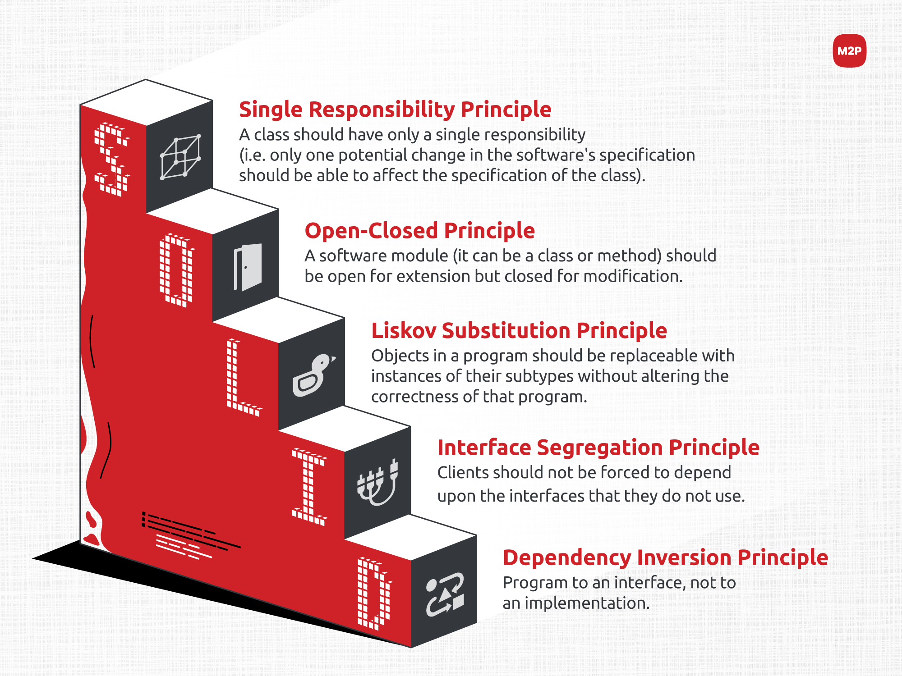

# [JAVA] - Buổi 9: Software Design nhập môn


---

## SOLID là gì? 

**SOLID** là tập hợp năm nguyên tắc thiết kế trong lập trình hướng đối tượng, giúp tạo ra mã nguồn dễ hiểu, dễ bảo trì và mở rộng. Các nguyên tắc này bao gồm:

1. **Single Responsibility Principle (SRP) - Nguyên tắc trách nhiệm đơn lẻ**: Mỗi lớp chỉ nên đảm nhận một trách nhiệm duy nhất. Khi một lớp đảm nhận nhiều trách nhiệm, việc thay đổi một phần của lớp có thể ảnh hưởng đến các phần khác, dẫn đến mã nguồn khó bảo trì và dễ phát sinh lỗi. Bằng cách tuân thủ SRP, chúng ta đảm bảo rằng mỗi lớp có một mục đích rõ ràng, giúp mã nguồn trở nên trong sáng, dễ hiểu và dễ dàng quản lý.
- **Ví dụ:**

Giả sử chúng ta có một lớp `OrderProcessor` chịu trách nhiệm xử lý đơn hàng:

```java
public class OrderProcessor {
    public void process(Order order) {
        if (validate(order)) {
            saveToDatabase(order);
            sendConfirmationEmail(order);
        }
    }

    private boolean validate(Order order) {
        // Thực hiện xác thực đơn hàng
    }

    private void saveToDatabase(Order order) {
        // Lưu đơn hàng vào cơ sở dữ liệu
    }

    private void sendConfirmationEmail(Order order) {
        // Gửi email xác nhận đến khách hàng
    }
}
```
Trong ví dụ trên, lớp OrderProcessor vi phạm nguyên tắc SRP vì nó đảm nhận nhiều trách nhiệm: xác thực đơn hàng, lưu trữ vào cơ sở dữ liệu và gửi email xác nhận. Để tuân thủ SRP, chúng ta nên tách các chức năng này thành các lớp riêng biệt:

``` java
public class OrderValidator {
    public boolean validate(Order order) {
        // Thực hiện xác thực đơn hàng
    }
}

public class OrderRepository {
    public void save(Order order) {
        // Lưu đơn hàng vào cơ sở dữ liệu
    }
}

public class EmailService {
    public void sendOrderConfirmationEmail(Order order) {
        // Gửi email xác nhận đến khách hàng
    }
}

public class OrderProcessor {
    private OrderValidator validator = new OrderValidator();
    private OrderRepository repository = new OrderRepository();
    private EmailService emailService = new EmailService();

    public void process(Order order) {
        if (validator.validate(order)) {
            repository.save(order);
            emailService.sendOrderConfirmationEmail(order);
        }
    }
}
```
- Lợi ích của việc áp dụng SRP:
    - Dễ bảo trì: Khi mỗi lớp chỉ đảm nhận một trách nhiệm, việc xác định và sửa lỗi trở nên đơn giản hơn.
    - Tái sử dụng cao: Các lớp với chức năng cụ thể có thể được tái sử dụng trong các phần khác của ứng dụng hoặc trong các dự án khác.
    - Dễ mở rộng: Việc thêm chức năng mới hoặc thay đổi chức năng hiện tại ít ảnh hưởng đến các phần khác của hệ thống.
2. **Open/Closed Principle (OCP) - Nguyên tắc mở/đóng**: Các thực thể phần mềm nên được mở để mở rộng nhưng đóng để sửa đổi. có nghĩa là khi cần thêm chức năng hoặc thay đổi hành vi của một thành phần, chúng ta nên thực hiện bằng cách mở rộng (ví dụ: thông qua kế thừa hoặc triển khai giao diện) thay vì thay đổi mã nguồn hiện có. Việc này giúp bảo vệ mã nguồn gốc, giảm thiểu rủi ro phát sinh lỗi khi chỉnh sửa và tăng tính ổn định cho hệ thống.
-   **Ví dụ:**
    Giả sử chúng ta có một lớp `Employee` tính lương cho nhân viên:

```java
public class Employee {
    private String name;
    private double salary;

    public Employee(String name, double salary) {
        this.name = name;
        this.salary = salary;
    }

    public double calculateSalary() {
        return salary;
    }
}
```
Bây giờ, công ty muốn thêm loại nhân viên Manager với khoản thưởng bổ sung. Thay vì sửa đổi lớp Employee, chúng ta có thể mở rộng bằng cách tạo lớp con:
```java
public class Manager extends Employee {
    private double bonus;

    public Manager(String name, double salary, double bonus) {
        super(name, salary);
        this.bonus = bonus;
    }

    @Override
    public double calculateSalary() {
        return super.calculateSalary() + bonus;
    }
}
```
- Lợi ích của việc áp dụng OCP:
    - Giảm thiểu rủi ro: Hạn chế việc sửa đổi mã nguồn đã hoạt động ổn định, giảm nguy cơ phát sinh lỗi.
    - Dễ bảo trì: Việc thêm chức năng mới trở nên dễ dàng hơn thông qua mở rộng, không ảnh hưởng đến các phần khác của hệ thống.
    - Tăng tính linh hoạt: Hệ thống dễ dàng thích ứng với các yêu cầu thay đổi mà không cần tái cấu trúc lớn.


3. **Liskov Substitution Principle (LSP) - Nguyên tắc thay thế Liskov**: Các đối tượng của lớp con phải có thể thay thế cho các đối tượng của lớp cha mà không làm thay đổi tính đúng đắn của chương trình. Có nghĩa là các lớp dẫn xuất (lớp con) phải duy trì hành vi của lớp cơ sở (lớp cha) và không được vi phạm các ràng buộc mà lớp cơ sở đã thiết lập. Khi một lớp con thay thế lớp cha, chương trình vẫn phải hoạt động chính xác mà không cần biết đến sự khác biệt giữa các lớp.

   - **Ví dụ:**
Giả sử chúng ta có lớp `HinhChuNhat` (Hình chữ nhật) và lớp `HinhVuong` (Hình vuông) kế thừa từ `HinhChuNhat`:

        ```java
        public class HinhChuNhat {
            protected double chieuDai;
            protected double chieuRong;

            public void setChieuDai(double chieuDai) {
                this.chieuDai = chieuDai;
            }

            public void setChieuRong(double chieuRong) {
                this.chieuRong = chieuRong;
            }

            public double tinhDienTich() {
                return chieuDai * chieuRong;
            }
        }
        
        public class HinhVuong extends HinhChuNhat {
            @Override
            public void setChieuDai(double canh) {
                this.chieuDai = canh;
                this.chieuRong = canh;
            }

            @Override
            public void setChieuRong(double canh) {
                this.chieuDai = canh;
                this.chieuRong = canh;
            }
        }
        ```
    Trong ví dụ trên, HinhVuong kế thừa từ HinhChuNhat và ghi đè các phương thức setChieuDai và setChieuRong để đảm bảo chiều dài và chiều rộng luôn bằng nhau. Tuy nhiên, điều này vi phạm LSP vì khi thay thế HinhChuNhat bằng HinhVuong, hành vi của chương trình có thể thay đổi ngoài ý muốn. Để tuân thủ nguyên tắc LSP, chúng ta nên thiết kế lại các lớp để tránh vi phạm. Một cách tiếp cận là tạo một lớp cơ sở chung HinhHoc và cho HinhChuNhat và HinhVuong kế thừa từ lớp này:
    ```java
    public abstract class HinhHoc {
        public abstract double tinhDienTich();
    }

    public class HinhChuNhat extends HinhHoc {
        protected double chieuDai;
        protected double chieuRong;

        public HinhChuNhat(double chieuDai, double chieuRong) {
            this.chieuDai = chieuDai;
            this.chieuRong = chieuRong;
        }

        @Override
        public double tinhDienTich() {
            return chieuDai * chieuRong;
        }
    }

    public class HinhVuong extends HinhHoc {
        private double canh;

        public HinhVuong(double canh) {
            this.canh = canh;
        }

        @Override
        public double tinhDienTich() {
            return canh * canh;
        }
    }
    ```
    - Lợi ích của việc áp dụng LSP:
        - Tăng tính linh hoạt: Các lớp con có thể được sử dụng thay thế cho lớp cha mà không gây ra lỗi hoặc thay đổi hành vi chương trình.
        - Dễ bảo trì: Giảm thiểu rủi ro khi thay đổi hoặc mở rộng mã nguồn, do các lớp con tuân thủ hợp đồng của lớp cha.
        - Tái sử dụng mã: Các thành phần phần mềm có thể được tái sử dụng một cách hiệu quả trong các ngữ cảnh khác nhau mà không cần chỉnh sửa.

## KISS, DRY, YAGNI

Trong phát triển phần mềm, ngoài SOLID, còn có các nguyên tắc quan trọng khác giúp cải thiện chất lượng mã nguồn và hiệu quả làm việc:

### 1. KISS (Keep It Simple, Stupid)

**Định nghĩa:** Nguyên tắc KISS khuyến khích giữ cho thiết kế và triển khai phần mềm đơn giản nhất có thể. Tránh phức tạp hóa vấn đề khi không cần thiết.

**Ứng dụng:** Khi phát triển chức năng, hãy tìm giải pháp đơn giản và trực quan. Tránh thêm các tính năng hoặc logic không cần thiết, giúp mã nguồn dễ hiểu và bảo trì hơn.

**Những cách để áp dụng KISS:**
- Không lạm dụng các design parttern, các thư viện nếu như không cần thiết
- Phân loại nhỏ bài toán lớn ra thành các bài toán nhỏ hơn để xử lý ➔ làm mọi thứ đơn giản hơn
- Đặt tên biến, phương thức một cách rõ ràng, dễ đọc
### 2. DRY (Don't Repeat Yourself)

**Định nghĩa:** Nguyên tắc DRY nhấn mạnh việc tránh lặp lại mã nguồn. Mỗi phần logic nên được định nghĩa một lần và tái sử dụng khi cần.

**Ứng dụng:** Khi thấy cùng một đoạn mã xuất hiện ở nhiều nơi, hãy xem xét việc tạo hàm hoặc module chung để tái sử dụng, giảm thiểu sự trùng lặp và dễ dàng quản lý khi có thay đổi.

### 3. YAGNI (You Aren't Gonna Need It)

**Định nghĩa:** Nguyên tắc YAGNI khuyên rằng không nên triển khai những tính năng mà hiện tại không cần thiết, dựa trên giả định về nhu cầu trong tương lai.

**Ứng dụng:** Tập trung phát triển những chức năng cần thiết cho hiện tại. Tránh lãng phí thời gian và tài nguyên vào những tính năng chưa chắc sẽ được sử dụng, giúp dự án linh hoạt và dễ quản lý hơn.

## Mô hình MVC

**MVC (Model-View-Controller)** là một mẫu kiến trúc phần mềm phổ biến, giúp tách biệt ứng dụng thành ba thành phần chính:

1. **Model**: Quản lý dữ liệu và logic nghiệp vụ của ứng dụng. Model chịu trách nhiệm lấy, xử lý và cập nhật dữ liệu.

2. **View**: Quản lý giao diện người dùng và hiển thị dữ liệu. View nhận dữ liệu từ Model và hiển thị cho người dùng, đồng thời nhận tương tác từ người dùng và chuyển đến Controller.

3. **Controller**: Xử lý các yêu cầu từ View, tương tác với Model và quyết định View nào sẽ hiển thị. Controller đóng vai trò trung gian giữa Model và View, điều phối luồng dữ liệu và tương tác trong ứng dụng.

**Luồng xử lý trong MVC**:
Luồng xử lý trong MVC rất đơn giản, với web nó gồm các bước như sau:
1. Đầu tiên là Request từ người dùng được gửi từ client đến server 
2. Sau đó Controller dựa vào yêu cầu của người dùng tiến hành giao tiếp với Model để lấy data từ database
3. Cuối cùng Controller gửi dữ liệu vừa lấy được về View và hiển thị ra cho người dùng trên trình duyệt
   
**Lợi ích của MVC:**

- **Tách biệt trách nhiệm**: Mỗi thành phần có một nhiệm vụ riêng, giúp mã nguồn rõ ràng và dễ bảo trì.
- **Dễ dàng mở rộng và bảo trì**: Thay đổi trong một thành phần ít ảnh hưởng đến các thành phần khác.
- **Tái sử dụng mã nguồn**: Các thành phần có thể được tái sử dụng trong các phần khác của ứng dụng hoặc trong các dự án khác.


## Các thành phần chính trong lập trình giao diện

Khi phát triển giao diện người dùng (UI), có một số thành phần cơ bản thường được sử dụng:

1. **Cửa sổ (Window)**: Vùng chứa chính của ứng dụng, nơi chứa các thành phần giao diện khác.

2. **Bảng điều khiển (Panel)**: Khu vực chứa nhóm các thành phần giao diện, giúp tổ chức và sắp xếp UI một cách hợp lý.

3. **Nhãn (Label)**: Hiển thị văn bản tĩnh, cung cấp thông tin hoặc mô tả cho người dùng.

4. **Nút (Button)**: Thành phần tương tác, cho phép người dùng thực hiện hành động khi nhấn vào.

5. **Trường nhập liệu (Text Field)**: Cho phép người dùng nhập và chỉnh sửa văn bản.

6. **Hộp kiểm (Checkbox)**: Cho phép người dùng chọn hoặc bỏ chọn một tùy chọn.

7. **Nút radio (Radio Button)**: Cho phép người dùng chọn một tùy chọn trong một nhóm các tùy chọn.

8. **Danh sách (List)**: Hiển thị một danh sách các mục, cho phép người dùng chọn một hoặc nhiều mục.

9. **Thanh cuộn (Scrollbar)**: Cho phép người dùng cuộn nội dung khi nội dung vượt quá kích thước hiển thị.

10. **Thanh menu (Menu Bar)**: Chứa các mục menu, cung cấp các tùy chọn và chức năng cho người dùng.

Việc hiểu và sử dụng đúng các thành phần này giúp tạo ra giao diện người dùng thân thiện, trực quan và hiệu quả.

---
